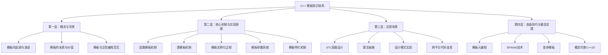
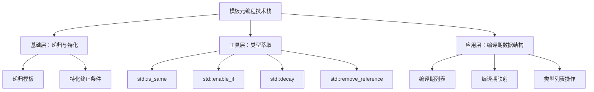

# C++ 模板知识体系设计文档

## 一、项目概述

### 1.1 项目目标
创建一个全面、深入的C++模板知识体系HTML文档，用于技术教学和深度理解C++模板机制。文档需要覆盖从基础概念到高级应用的完整知识链路，适合C++学习者系统性掌握模板编程。

### 1.2 目标用户
- C++中高级开发者，希望深入理解模板机制
- 系统工程师，需要掌握模板元编程技术
- 技术讲师，需要准备教学资料
- 面试准备者，需要系统复习模板知识点

### 1.3 文档特点
- 结构化组织：概念背景 → 核心机制 → 应用场景 → 高级技巧
- MECE原则：知识点分类互斥且完整穷尽
- 理论结合实践：每个知识点都配备代码示例和底层分析
- 可视化展示：使用树形结构展示知识体系

## 二、知识体系架构

### 2.1 整体架构设计

采用四层递进式架构，确保学习路径清晰：



### 2.2 知识点分层结构

#### 第一层：概念与背景
此层建立对模板的整体认知，解答"是什么"和"为什么"的问题。

| 知识模块 | 核心内容 | 教学目标 |
|---------|---------|---------|
| 模板的起源与演进 | C++模板的历史发展、从C++98到C++23的详细演变 | 理解模板技术的发展脉络和每个版本的关键特性 |
| 模板的本质与价值 | 编译期多态、代码生成机制、类型安全 | 掌握模板与宏、继承多态的本质区别 |
| 泛型编程范式 | 泛型编程思想、STL设计哲学、概念驱动设计 | 建立泛型编程的思维模式 |
| C++类型系统 | 类型分类、类型推导、类型转换、值类别 | 深入理解模板的类型基础 |

#### 第二层：核心机制与实现原理
此层深入模板的编译器实现，解答"怎么做"的问题。

**2.2.0 C++类型系统基础**

模板技术建立在C++类型系统之上，必须深入理解类型系统。

| 子模块 | 关键知识点 | 深度说明 |
|-------|----------|----------|
| 类型分类体系 | 基本类型、复合类型、用户定义类型 | 类型层次结构、类型完整性 |
| CV限定符 | const、volatile及其组合 | CV限定的传播、top-level vs low-level |
| 引用类型 | 左值引用、右值引用、引用折叠 | 引用的本质、引用与指针区别 |
| 值类别(Value Category) | lvalue、prvalue、xvalue、glvalue、rvalue | C++11的五种值类别体系 |
| 类型推导规则 | auto推导、decltype推导、模板参数推导 | 三种推导的差异和统一规则 |
| 类型转换 | 隐式转换、显式转换、用户定义转换 | 转换优先级、转换序列 |
| 类型兼容性 | 类型等价、类型匹配、类型替换 | 模板实例化中的类型匹配 |

**类型分类详细树状结构**

类型系统的完整分类对理解模板至关重要：

``mermaid
graph TB
    Root[C++类型系统] --> Fundamental[基本类型]
    Root --> Compound[复合类型]
    Root --> UserDefined[用户定义类型]
    
    Fundamental --> Void[void]
    Fundamental --> Nullptr[std::nullptr_t]
    Fundamental --> Arithmetic[算术类型]
    
    Arithmetic --> Integral[整型]
    Arithmetic --> FloatingPoint[浮点型]
    
    Integral --> Bool[bool]
    Integral --> Char[字符类型: char, wchar_t, char8_t, char16_t, char32_t]
    Integral --> SignedInt[有符号整型: short, int, long, long long]
    Integral --> UnsignedInt[无符号整型: unsigned variants]
    
    FloatingPoint --> Float[float]
    FloatingPoint --> Double[double]
    FloatingPoint --> LongDouble[long double]
    
    Compound --> Pointer[指针类型]
    Compound --> Reference[引用类型]
    Compound --> Array[数组类型]
    Compound --> Function[函数类型]
    Compound --> MemberPointer[成员指针类型]
    
    Reference --> LvalueRef[左值引用 T&]
    Reference --> RvalueRef[右值引用 T&&]
    
    UserDefined --> Class[类类型]
    UserDefined --> Enum[枚举类型]
    UserDefined --> Union[联合体类型]
    
    Enum --> ScopedEnum[enum class: 强类型枚举]
    Enum --> UnscopedEnum[enum: 传统枚举]
    
    style Root fill:#3498db,color:#fff
    style Fundamental fill:#e74c3c,color:#fff
    style Compound fill:#f39c12,color:#fff
    style UserDefined fill:#27ae60,color:#fff
```

**值类别系统 (C++11后)**

值类别是现代模板编程的核心概念，尤其是完美转发和移动语义。

| 值类别 | 定义 | 特征 | 典型例子 |
|-------|------|------|----------|
| lvalue | 有名字的对象或返回左值引用的表达式 | 可以取地址、可以出现在赋值左侧 | 变量名、*ptr、返回T&的函数 |
| prvalue | 纯右值，临时对象或字面量 | 不能取地址、即将被销毁 | 字面量42、返回T的函数、Lambda表达式 |
| xvalue | 将亡值，生命周期即将结束的对象 | 可以被移动 | std::move(x)、返回T&&的函数 |
| glvalue | 广义左值 = lvalue + xvalue | 有内存位置 | 所有lvalue和xvalue |
| rvalue | 右值 = prvalue + xvalue | 可以出现在赋值右侧 | 所有prvalue和xvalue |

值类别决定树：

``mermaid
graph TB
    Start[表达式] --> Q1{有身份/内存位置?}
    Q1 -->|是| Q2{可以被移动?}
    Q1 -->|否| prvalue[prvalue<br/>纯右值]
    
    Q2 -->|是| xvalue[xvalue<br/>将亡值]
    Q2 -->|否| lvalue[lvalue<br/>左值]
    
    lvalue -.属于.-> glvalue[glvalue<br/>泛左值]
    xvalue -.属于.-> glvalue
    xvalue -.属于.-> rvalue[rvalue<br/>右值]
    prvalue -.属于.-> rvalue
    
    style lvalue fill:#2ecc71
    style prvalue fill:#e74c3c
    style xvalue fill:#f39c12
    style glvalue fill:#3498db
    style rvalue fill:#9b59b6
```

**类型推导规则统一框架**

| 推导方式 | 推导规则 | 引用处理 | CV限定符处理 | 数组/函数退化 |
|---------|---------|---------|-------------|-------------|
| auto推导 | 类似模板参数推导 | auto&保留引用 | auto忽略顶层const | 会退化 |
| decltype(expr) | 保持表达式类型 | 完全保留 | 完全保留 | 不退化 |
| decltype(auto) | 结合两者 | 保留值类别 | 保留CV | 不退化 |
| 模板T推导 | 标准推导规则 | T&不退化，T退化 | 忽略顶层const | T会退化，T&不会 |

**2.2.1 函数模板机制**

| 子模块 | 关键知识点 | 实现原理 |
|-------|----------|---------|
| 函数模板基础语法 | template关键字、类型参数声明、模板函数定义 | 编译器如何解析模板声明 |
| 模板参数推导 | 自动类型推导规则、引用折叠、完美转发 | 编译器类型推导算法 |
| 函数模板重载 | 重载决议规则、模板与非模板函数的优先级 | 重载解析的两阶段查找 |
| 函数模板的实例化时机 | 隐式实例化、显式实例化、延迟实例化 | 实例化的编译器策略 |

**2.2.2 类模板机制**

| 子模块 | 关键知识点 | 实现原理 |
|-------|----------|---------|
| 类模板基础语法 | 类模板声明、成员函数定义、嵌套类型 | 类模板的符号表管理 |
| 类模板成员函数 | 成员函数模板、静态成员、友元函数 | 成员函数的按需实例化 |
| 类模板的实例化 | 完整实例化、部分实例化、成员函数延迟实例化 | 编译器的实例化策略 |
| 模板类的继承 | 依赖基类、模板派生、访问控制 | 名称查找的两阶段机制 |

**2.2.3 模板实例化过程**

``mermaid
graph LR
    A[模板定义] --> B[模板解析阶段]
    B --> C[第一次检查：语法检查]
    C --> D[等待实例化]
    D --> E[遇到具体类型]
    E --> F[模板实例化]
    F --> G[第二次检查：语义检查]
    G --> H[代码生成]
    H --> I[符号导出]
```

| 阶段 | 编译器行为 | 检查内容 |
|-----|----------|---------|
| 模板定义阶段 | 解析模板语法结构 | 语法正确性、模板参数合法性 |
| 第一次检查 | 不依赖模板参数的代码检查 | 非依赖类型的名称查找 |
| 实例化触发 | 遇到具体类型调用 | 匹配模板参数 |
| 第二次检查 | 替换模板参数后的完整检查 | 依赖类型的名称查找、类型匹配 |
| 代码生成 | 生成特定类型的实际代码 | 优化、内联决策 |

**2.2.4 模板参数系统**

模板参数的完整分类：

| 参数类型 | 语法形式 | 使用场景 | 约束条件 |
|---------|---------|---------|---------|
| 类型参数 | typename T, class T | 表示任意类型 | 必须是完整类型或明确声明 |
| 非类型参数 | int N, size_t Size | 编译期常量值 | 必须是整型、枚举、指针、引用 |
| 模板模板参数 | template&lt;typename&gt; class Container | 接受模板作为参数 | 参数个数和默认参数必须匹配 |
| 参数包(C++11) | typename... Args | 可变数量参数 | 需要配合参数展开 |

**2.2.5 模板特化机制**

``mermaid
graph TB
    A[模板特化体系] --> B[全特化]
    A --> C[偏特化]
    
    B --> B1[函数模板全特化]
    B --> B2[类模板全特化]
    
    C --> C1[类模板偏特化]
    C --> C2[部分参数特化]
    C --> C3[指针类型特化]
    C --> C4[引用类型特化]
    C --> C5[数组类型特化]
    
    style B fill:#e1f5ff
    style C fill:#fff4e1
```

| 特化类型 | 定义特点 | 使用时机 | 匹配优先级 |
|---------|---------|---------|-----------|
| 全特化 | 所有模板参数具体化 | 针对特定类型优化 | 最高优先级 |
| 偏特化 | 部分参数具体化或添加约束 | 针对类型族优化 | 高于主模板 |
| 主模板 | 通用实现 | 默认行为 | 最低优先级 |

#### 第三层：应用场景
此层展示模板在实际工程中的应用，解答"在哪用"的问题。

**3.1 STL容器设计**

| 容器类别 | 模板技术运用 | 设计要点 |
|---------|-------------|---------|
| 序列容器 | 类型参数、分配器模板参数 | 内存管理抽象、迭代器设计 |
| 关联容器 | 比较函数对象模板、键值类型参数 | 红黑树实现、哈希策略 |
| 无序容器 | 哈希函数模板、相等性判断模板 | 哈希冲突处理、负载因子控制 |
| 容器适配器 | 底层容器模板参数 | 接口适配、行为约束 |

**3.2 算法抽象**

算法与数据结构解耦的关键：

| 算法类别 | 模板参数 | 抽象机制 |
|---------|---------|---------|
| 非修改序列算法 | 迭代器类型、谓词函数对象 | 迭代器萃取、函数对象策略 |
| 修改序列算法 | 输入/输出迭代器、转换函数 | 迭代器分类、范围检查 |
| 排序算法 | 随机访问迭代器、比较函数 | 快速排序优化、稳定性保证 |
| 数值算法 | 值类型、二元操作 | 数值特性萃取、精度控制 |

**3.3 设计模式中的模板应用**

| 设计模式 | 模板实现方式 | 优势 |
|---------|------------|------|
| 单例模式 | CRTP (Curiously Recurring Template Pattern) | 编译期绑定、零运行时开销 |
| 策略模式 | 策略类作为模板参数 | 编译期策略选择、无虚函数开销 |
| 工厂模式 | 模板工厂类、类型注册 | 类型安全、自动注册 |
| 观察者模式 | 事件类型模板化 | 强类型事件系统 |
| 适配器模式 | 模板适配器包装 | 编译期适配、零抽象成本 |

**3.4 跨平台代码复用**

| 应用领域 | 模板作用 | 示例 |
|---------|---------|------|
| 数学库 | 类型无关的数值计算 | 矩阵运算、向量计算 |
| 序列化框架 | 自动序列化/反序列化 | JSON、XML、Protocol Buffers |
| 智能指针 | 资源管理抽象 | unique_ptr、shared_ptr、weak_ptr |
| 线程池 | 任务类型抽象 | 异步任务、Future/Promise |

#### 第四层：高级技巧与最佳实践
此层探索模板编程的前沿技术，解答"如何精通"的问题。

**4.1 模板元编程 (Template Metaprogramming)**

模板元编程的核心理念：将计算从运行期转移到编译期。

| 元编程技术 | 实现机制 | 应用场景 |
|-----------|---------|---------|
| 编译期计算 | 递归模板实例化、模板特化终止 | 阶乘计算、斐波那契数列、编译期常量 |
| 类型计算 | 类型萃取、类型变换 | 移除const/引用、判断类型关系 |
| 编译期条件选择 | std::conditional、if constexpr (C++17) | 类型选择、代码分支裁剪 |
| 编译期循环 | 参数包展开、折叠表达式 (C++17) | 元组遍历、编译期数组操作 |



**4.2 SFINAE技术 (Substitution Failure Is Not An Error)**

SFINAE是模板高级技巧的核心机制。

| SFINAE应用 | 技术实现 | 使用目的 |
|-----------|---------|---------|
| 函数重载选择 | 返回类型SFINAE、参数SFINAE | 根据类型特性选择不同实现 |
| 类型检测 | decltype + SFINAE | 检测成员函数、成员变量是否存在 |
| Concept模拟 | enable_if + type_traits | C++20之前的概念约束 |
| 表达式有效性检测 | void_t技巧 | 检测表达式是否合法 |

SFINAE工作流程：

``mermaid
sequenceDiagram
    participant 编译器
    participant 候选函数集
    participant SFINAE检查
    participant 重载决议
    
    编译器->>候选函数集: 收集所有可能的函数
    候选函数集->>SFINAE检查: 尝试模板参数替换
    SFINAE检查->>SFINAE检查: 替换失败？
    alt 替换失败
        SFINAE检查->>候选函数集: 从候选集移除(不报错)
    else 替换成功
        SFINAE检查->>重载决议: 加入有效候选
    end
    重载决议->>编译器: 选择最佳匹配
```

**4.3 变参模板 (Variadic Templates)**

C++11引入的强大特性，支持任意数量的模板参数。

| 技术要点 | 语法形式 | 核心机制 |
|---------|---------|---------|
| 参数包声明 | typename... Args | 声明参数包 |
| 参数包展开 | args... | 展开参数包 |
| 递归展开 | 递归函数 + 终止条件 | 逐个处理参数 |
| 折叠表达式(C++17) | (args + ...) | 一次性展开所有参数 |
| sizeof...运算符 | sizeof...(Args) | 获取参数包大小 |

变参模板的典型应用模式：

``mermaid
graph LR
    A[变参模板应用] --> B[完美转发]
    A --> C[元组实现]
    A --> D[可变参数函数包装]
    A --> E[类型列表操作]
    
    B --> B1[std::forward]
    B --> B2[万能引用]
    
    C --> C1[递归继承]
    C --> C2[索引访问]
    
    D --> D1[printf类型安全版本]
    D --> D2[日志系统]
    
    E --> E1[类型筛选]
    E --> E2[类型查找]
```

**4.4 C++20概念 (Concepts)**

Concepts是对模板参数的命名约束，提升代码可读性和错误提示。

| 概念类型 | 定义方式 | 作用 |
|---------|---------|------|
| 类型约束 | requires表达式 | 约束模板参数必须满足的条件 |
| 概念定义 | concept关键字 | 定义可重用的约束 |
| 约束组合 | &&、\|\| 逻辑运算 | 组合多个约束 |
| 简写函数模板 | auto参数 + 概念 | 简化模板函数语法 |

概念与传统SFINAE对比：

| 对比维度 | SFINAE (C++17前) | Concepts (C++20) |
|---------|-----------------|-----------------|
| 可读性 | 晦涩难懂 | 清晰直观 |
| 错误信息 | 冗长的模板实例化栈 | 精确指出约束失败 |
| 重载决议 | 隐式参与 | 显式约束优先级 |
| 组合性 | 困难 | 自然支持逻辑组合 |
| 编译速度 | 较慢 | 更快 |

**4.5 最佳实践与性能优化**

| 实践领域 | 指导原则 | 理由 |
|---------|---------|------|
| 模板声明与定义分离 | 避免分离，使用头文件或显式实例化 | 模板需要定义可见才能实例化 |
| 模板参数命名 | 使用有意义的名称，如ValueType而非T | 提升代码可读性 |
| 避免模板代码膨胀 | 提取非依赖模板参数的代码到基类 | 减少二进制体积 |
| 编译期计算优先 | 使用constexpr而非模板元编程 (C++11后) | 更清晰、编译更快 |
| 概念约束 | 尽早约束模板参数 (C++20) | 更好的错误提示 |
| 完美转发 | 使用std::forward保持值类别 | 避免不必要的拷贝 |

## 三、文档输出规格

### 3.1 文档结构设计

HTML文档的整体布局：

| 文档部分 | 内容组成 | 设计目标 |
|---------|---------|---------|
| 文档头部 | 标题、样式定义、脚本引用 | 统一视觉风格、交互功能 |
| 目录导航 | 自动生成的多级目录、锚点链接 | 快速定位知识点 |
| 知识体系树 | 树形结构展示完整知识图谱 | 宏观把握体系 |
| 章节内容 | 概念讲解、代码示例、原理分析 | 深度学习 |
| 参考文献 | 标准文档、经典书籍、技术文章 | 拓展阅读 |

### 3.2 内容组织方式

每个知识点的标准组织模式：

``mermaid
graph TB
    A[知识点标题] --> B[概念定义]
    B --> C[为什么需要]
    C --> D[工作原理]
    D --> E[代码示例]
    E --> F[底层实现分析]
    F --> G[应用场景]
    G --> H[注意事项]
    H --> I[相关知识点链接]
```

| 内容模块 | 呈现形式 | 内容要求 |
|---------|---------|---------|
| 概念定义 | 高亮文本框 | 简洁准确，一句话说清 |
| 原理说明 | 段落文字 + 流程图 | 深入浅出，逻辑清晰 |
| 代码示例 | 语法高亮代码块 | 完整可编译、有详细注释 |
| 底层分析 | 表格 + 文字说明 | 揭示编译器行为 |
| 应用场景 | 实际案例 | 贴近工程实践 |
| 扩展阅读 | 引用链接 | 权威来源 |

### 3.3 可视化元素

| 元素类型 | 使用场景 | 设计规范 |
|---------|---------|---------|
| 知识树状图 | 知识体系总览、模块内部结构 | 使用树形CSS样式，层级清晰 |
| 流程图 | 模板实例化过程、编译器行为 | 使用Mermaid图表 |
| 对比表格 | 技术对比、版本差异 | 斑马纹样式，重点高亮 |
| 信息框 | 注意事项、重点提示 | 分颜色类型：提示、警告、信息 |
| 代码高亮 | 所有代码示例 | 语法着色、行号、关键字高亮 |

### 3.4 样式设计规范

| 样式元素 | 设计要求 | 具体规格 |
|---------|---------|---------|
| 色彩方案 | 专业、护眼、层次分明 | 主色：蓝色系，辅色：橙色、绿色 |
| 排版 | 清晰易读、留白充足 | 行高1.6，段落间距15px |
| 字体 | 代码与正文区分 | 正文：系统字体，代码：Menlo/Monaco |
| 响应式 | 适配不同屏幕 | 最大宽度1200px，移动端自适应 |
| 交互 | 平滑过渡、悬停反馈 | 链接悬停、代码块阴影 |

### 3.5 代码示例规范

所有代码示例必须遵循的规范：

| 规范项 | 要求 | 示例说明 |
|-------|------|---------|
| 完整性 | 可直接编译运行 | 包含必要的头文件、命名空间 |
| 注释 | 关键行必有注释 | 解释模板参数、实例化过程 |
| 命名 | 语义化命名 | 模板参数用T、U、Args等通用名 |
| 格式 | 统一缩进与换行 | 4空格缩进，运算符两侧空格 |
| 版本标注 | 标明需要的C++标准 | 使用C++11/14/17/20特性需注明 |
| 输出展示 | 展示运行结果 | 代码后附上输出结果 |

### 3.6 底层实现分析标准

对于核心机制的底层分析，需要包含：

| 分析维度 | 内容要求 |
|---------|---------|
| 编译器视角 | 说明编译器如何处理模板代码 |
| 符号生成 | 解释name mangling机制 |
| 内存布局 | 分析模板实例化后的内存结构 |
| 汇编代码 | 关键部分展示汇编代码对比 |
| 性能影响 | 量化模板对性能的影响 |

## 四、知识点详细拆分

### 4.1 第一层：概念与背景知识点

**4.1.1 模板的起源与演进**

模板技术经历了近30年的演进，每个版本都带来重大突破。

**C++模板诞生背景 (1990年代初期)**

| 方面 | 详细说明 |
|------|----------|
| 历史契机 | 1988年，Bjarne Stroustrup和Andrew Koenig提出模板概念，解决代码复用难题 |
| 设计目标 | 实现类型安全的泛型编程，避免宏的缺陷（无类型检查、作用域污染） |
| 核心理念 | 编译期多态，零运行时开销抽象 |
| 首次应用 | 标准模板库(STL)由Alexander Stepanov设计，成为模板技术的杀手级应用 |

**C++98/03 标准时期**

| 特性 | 详细说明 | 代码模式示例描述 |
|------|----------|------------------|
| 基础函数模板 | 支持类型参数化函数，自动类型推导 | template<typename T> void swap(T& a, T& b) |
| 基础类模板 | 支持类型参数化类，容器基础 | template<typename T> class vector |
| 模板特化 | 全特化和偏特化，针对特定类型优化 | 指针类型特化、const特化 |
| 模板模板参数 | 模板作为模板参数 | template<template<typename> class Container> |
| 非类型模板参数 | 整数、指针、引用作为模板参数 | template<int N> class Array |
| 成员函数模板 | 类的成员可以是模板函数 | 拷贝构造的泛型版本 |
| typename关键字 | 消除依赖类型名称的歧义 | typename Container::value_type |
| 导出模板(export) | 分离模板声明与定义（后被废弃） | 实现过于复杂，编译器支持差 |
| 局限性 | 无法处理可变参数、缺乏编译期条件、错误信息晦涩 | 需要手动重载或宏辅助 |

**C++11 革命性变革**

C++11是模板技术的重大飞跃，引入多项现代化特性。

| 特性 | 详细说明 | 技术影响 | 典型应用 |
|------|----------|----------|----------|
| 变参模板 | 支持任意数量的模板参数 | 彻底解决可变参数问题 | std::tuple、std::function、完美转发 |
| 右值引用 | T&&类型，移动语义 | 消除不必要拷贝，性能提升 | std::move、移动构造 |
| 万能引用 | 模板参数T&&的特殊推导 | 实现完美转发 | std::forward、工厂函数 |
| 完美转发 | 保持参数值类别的转发 | 零开销包装器 | std::make_shared、emplace系列 |
| 外部模板声明 | extern template显式控制实例化 | 减少编译时间和二进制体积 | 大型项目模板实例化优化 |
| 类型别名模板 | using模板化 | 简化类型定义 | using Vec = std::vector<T> |
| 默认模板参数 | 函数模板支持默认参数 | 增强灵活性 | 可选的比较器、分配器 |
| decltype | 类型推导表达式 | SFINAE、返回类型推导 | 尾置返回类型 |
| static_assert | 编译期断言 | 模板参数静态检查 | 类型约束验证 |
| std::enable_if | SFINAE工具 | 条件启用模板 | 类型特性约束 |
| 类型萃取库 | <type_traits>标准库 | 编译期类型查询和变换 | is_integral、remove_reference |

**C++14 渐进式改进**

| 特性 | 详细说明 | 与C++11对比 | 应用场景 |
|------|----------|-------------|----------|
| 变量模板 | 变量也可以模板化 | 补齐模板体系（函数、类、变量） | pi<double>、常量模板 |
| 泛型Lambda | lambda参数使用auto | 简化函数对象编写 | 算法谓词、回调函数 |
| 返回类型推导增强 | auto返回类型不需要尾置 | 简化语法 | 复杂返回类型的函数 |
| constexpr松绑 | constexpr函数可包含更多语句 | 扩展编译期计算能力 | 替代模板元编程 |
| std::make_unique | 补充智能指针工厂 | 完善C++11智能指针体系 | 异常安全的对象创建 |

**C++17 实用性增强**

| 特性 | 详细说明 | 解决的痛点 | 性能影响 |
|------|----------|-----------|----------|
| 类模板参数推导(CTAD) | 构造时自动推导模板参数 | 避免重复写类型 | 编译期优化，零运行时成本 |
| 折叠表达式 | 一行代码展开参数包 | 替代递归展开，代码简洁 | 编译更快，代码更少 |
| if constexpr | 编译期条件分支 | 替代SFINAE和标签分派 | 未实例化分支被裁剪 |
| 结构化绑定 | 与模板结合使用 | 简化元组、pair使用 | 零开销抽象 |
| std::variant | 类型安全的union | 模板化的联合体 | 访问时有轻微开销 |
| std::optional | 可选值模板 | 避免特殊值表示缺失 | 栈上存储，高效 |
| std::any | 类型擦除容器 | 存储任意类型 | 有运行时开销 |
| 内联变量 | inline变量模板 | 解决ODR问题 | 链接期优化 |
| 简化嵌套命名空间 | 语法糖 | 减少嵌套层级 | 仅语法改进 |

**C++20 范式转变**

C++20引入Concepts，是模板技术的又一次革命。

| 特性 | 详细说明 | 革命性意义 | 生态影响 |
|------|----------|-----------|----------|
| Concepts | 命名的模板约束 | 从SFINAE转向声明式约束 | 重塑模板编程范式 |
| Requires子句 | 约束模板参数 | 明确接口契约 | 错误信息从数百行降至几行 |
| 标准Concepts库 | 迭代器、范围等概念 | 统一STL约束体系 | 替代SFINAE惯用法 |
| 约束的偏序 | 约束的强弱比较 | 精确控制重载决议 | 更智能的函数选择 |
| 简写函数模板 | auto参数自动生成模板 | 极简语法 | 降低学习门槛 |
| 范围库(Ranges) | 基于Concepts的新STL | 组合式算法 | 函数式编程风格 |
| 三路比较运算符 | <=>与模板结合 | 自动生成比较函数 | 减少样板代码 |
| 模板Lambda | Lambda可以是模板 | 增强泛型能力 | 简化泛型算法 |
| consteval | 强制编译期求值 | 比constexpr更严格 | 纯编译期计算 |
| constinit | 编译期初始化变量 | 避免静态初始化顺序问题 | 零运行时初始化 |

**C++23 持续演进**

| 特性 | 详细说明 | 改进点 |
|------|----------|--------|
| if consteval | 区分编译期与运行期 | 更细粒度的编译期控制 |
| 推导this | 简化CRTP和递归Lambda | 消除显式模板参数 |
| 多维下标运算符 | operator[]支持多参数 | 多维容器的自然语法 |
| std::expected | 错误处理模板 | 函数式错误处理 |
| 范围库增强 | 更多视图和适配器 | 完善Ranges生态 |

**版本演进关系图**

``mermaid
graph TB
    A[C++98/03<br/>模板基础] --> B[C++11<br/>现代化革命]
    B --> C[C++14<br/>渐进改进]
    C --> D[C++17<br/>实用增强]
    D --> E[C++20<br/>Concepts范式]
    E --> F[C++23<br/>持续完善]
    
    A -->|核心能力| A1[函数/类模板<br/>特化<br/>模板模板参数]
    B -->|重大突破| B1[变参模板<br/>右值引用<br/>完美转发<br/>类型萃取]
    C -->|补充完善| C1[变量模板<br/>泛型Lambda]
    D -->|简化使用| D1[CTAD<br/>if constexpr<br/>折叠表达式]
    E -->|范式转变| E1[Concepts<br/>Ranges<br/>约束系统]
    F -->|深化应用| F1[推导this<br/>多维下标]
    
    style A fill:#d4e6f1
    style B fill:#aed6f1
    style C fill:#85c1e2
    style D fill:#5dade2
    style E fill:#3498db
    style F fill:#2874a6
```

**4.1.1 模板的起源与演进**

| 知识点 | 内容要点 |
|-------|---------|
| C++模板诞生背景 | 1990年代，为了实现类型安全的泛型编程 |
| C++98/03时期 | 基础模板、特化、模板模板参数 |
| C++11革新 | 变参模板、右值引用、完美转发、外部模板 |
| C++14改进 | 变量模板、泛型lambda |
| C++17增强 | 类模板参数推导、折叠表达式、if constexpr |
| C++20突破 | Concepts、约束、简写函数模板 |

**4.1.2 模板的本质**

需要深入对比的主题：

| 对比主题 | 关键区别 | 深度分析 |
|---------|---------|---------|
| 模板 vs 宏 | 类型安全、作用域、调试性 | 展示预处理与模板实例化的区别 |
| 模板 vs 继承多态 | 编译期 vs 运行期、性能、灵活性 | 分析虚函数表与模板代码生成 |
| 模板 vs 函数重载 | 代码复用程度、维护性 | 展示模板如何避免重载爆炸 |

**4.1.3 泛型编程范式**

| 核心概念 | 内容覆盖 |
|---------|---------|
| 算法与数据结构分离 | STL设计理念、迭代器作为桥梁 |
| 概念驱动设计 | 类型必须满足的操作集合 |
| 静态多态 | 编译期绑定的优势 |
| 零成本抽象 | 模板如何实现零运行时开销 |

### 4.2 第二层：核心机制知识点

**4.2.1 函数模板深度拆解**

| 子知识点 | 详细内容 |
|---------|---------|
| 基础语法 | template声明、类型参数、函数定义位置 |
| 类型推导 | auto推导、引用推导、数组与函数退化 |
| 模板参数匹配 | 精确匹配、类型转换、重载决议 |
| 显式特化 | 全特化语法、特化匹配规则 |
| 实例化控制 | 显式实例化声明与定义、extern template |

**4.2.2 类模板深度拆解**

| 子知识点 | 详细内容 |
|---------|---------|
| 类模板声明与定义 | 模板参数列表、成员声明、类外定义 |
| 成员函数模板 | 普通成员、静态成员、const成员 |
| 嵌套类型 | typedef、using、嵌套类 |
| 静态成员 | 静态数据成员定义、静态函数 |
| 友元 | 友元函数、友元类、模板友元 |
| 类模板特化 | 全特化、偏特化、成员特化 |

**4.2.3 模板参数详解**

| 参数类型 | 深入内容 |
|---------|---------|
| 类型参数 | typename vs class、依赖类型名、嵌套依赖 |
| 非类型参数 | 允许的类型、常量表达式要求、浮点数限制 |
| 模板模板参数 | 语法、参数匹配、默认模板参数 |
| 默认模板参数 | 语法、继承规则、C++11放宽限制 |
| 参数包 | 声明、展开、sizeof... |

**4.2.4 特化机制完整讲解**

| 特化类型 | 知识点 |
|---------|-------|
| 函数模板全特化 | 语法、匹配规则、与重载的关系 |
| 类模板全特化 | 完全替代主模板、成员独立定义 |
| 类模板偏特化 | 部分参数特化、类型模式特化 |
| 成员特化 | 单独特化成员函数 |
| 特化匹配顺序 | 编译器选择规则、最特化原则 |

**4.2.5 模板实例化深度分析**

| 知识点 | 核心内容 |
|-------|---------|
| 隐式实例化 | 触发条件、按需实例化、ODR规则 |
| 显式实例化 | 声明与定义、减少编译时间 |
| 实例化时机 | 两阶段编译、延迟实例化 |
| 实例化点 | POI (Point of Instantiation)、影响名称查找 |
| 实例化深度 | 递归实例化限制、编译器限制 |

**4.2.6 名称查找规则**

| 知识点 | 深入讲解 |
|-------|---------|
| 依赖名称 vs 非依赖名称 | 定义、查找时机 |
| 两阶段名称查找 | 第一阶段、第二阶段、ADL |
| typename关键字 | 何时必须使用、嵌套依赖类型 |
| template关键字 | 消除歧义、依赖模板名称 |
| ADL (Argument-Dependent Lookup) | Koenig查找、影响重载决议 |

### 4.3 第三层：应用场景知识点

**4.3.1 STL源码分析**

每个组件的模板分析：

| STL组件 | 模板分析重点 |
|---------|------------|
| vector | 动态数组模板、allocator模板参数、迭代器实现 |
| list | 双向链表、节点模板、splice操作 |
| map/set | 红黑树模板、比较函数对象、键值分离 |
| unordered_map | 哈希表模板、桶管理、冲突解决 |
| algorithm | 迭代器萃取、函数对象、返回类型推导 |
| iterator | 迭代器类别、萃取技术、反向迭代器 |
| function | 类型擦除、可调用对象包装 |

**4.3.2 智能指针实现**

| 智能指针类型 | 模板设计要点 |
|------------|-------------|
| unique_ptr | 独占所有权、移动语义、删除器模板 |
| shared_ptr | 引用计数、控制块、弱引用支持 |
| weak_ptr | 打破循环引用、lock操作 |
| 自定义删除器 | 函数对象模板、lambda支持 |

**4.3.3 设计模式模板实现**

每个模式的详细设计：

| 设计模式 | 模板实现细节 |
|---------|------------|
| CRTP单例 | 继承机制、静态成员、线程安全 |
| 策略模式 | 编译期策略、策略组合 |
| 观察者模式 | 类型安全事件、信号槽 |
| 工厂模式 | 类型注册、反射模拟 |
| 对象池 | 内存管理、类型擦除 |

### 4.4 第四层：高级技巧知识点

**4.4.1 模板元编程完整知识点**

| 技术 | 详细知识点 |
|-----|----------|
| 编译期计算 | 递归、特化终止、constexpr替代 |
| 类型萃取 | std::is_*系列、std::enable_if、std::conditional |
| 类型变换 | remove_*, add_*, decay |
| 编译期数据结构 | 类型列表、整数序列、编译期映射 |
| 元函数 | 类型元函数、值元函数 |

**4.4.2 SFINAE完整技术栈**

| 技术点 | 内容 |
|-------|------|
| SFINAE基本原理 | 替换失败、候选集管理 |
| 返回类型SFINAE | trailing return type、decltype |
| 参数SFINAE | enable_if参数 |
| 表达式SFINAE | decltype + 逗号表达式 |
| void_t技巧 | 检测成员存在性 |
| detection idiom | C++17实验性特性 |

**4.4.3 变参模板全面讲解**

| 知识点 | 详细内容 |
|-------|---------|
| 参数包基础 | 声明、展开位置 |
| 递归展开 | 递归函数、终止条件 |
| 折叠表达式 | 一元折叠、二元折叠 |
| 包展开技巧 | 逗号技巧、初始化列表展开 |
| 索引序列 | std::index_sequence、make_index_sequence |
| 元组实现 | 递归继承、索引访问 |

**4.4.4 C++20 Concepts**

| 知识点 | 内容 |
|-------|------|
| Concept定义 | requires表达式、类型约束、嵌套要求 |
| 标准Concepts | 迭代器Concepts、范围Concepts、比较Concepts |
| Requires子句 | 函数约束、类模板约束 |
| 约束组合 | 逻辑与、逻辑或、requires requires |
| 简写模板 | auto参数、缩写函数模板 |
| 重载决议 | 约束的偏序、最满足原则 |

**4.4.5 完美转发深度解析**

| 知识点 | 详细讲解 |
|-------|---------|
| 万能引用 | T&&的特殊推导规则 |
| 引用折叠 | 四种折叠规则 |
| std::forward | 实现原理、使用场景 |
| std::move | 与forward的区别 |
| 转发参数包 | 变参模板中的完美转发 |

**4.4.6 编译期优化技巧**

| 优化技术 | 说明 |
|---------|------|
| if constexpr | 编译期分支裁剪 |
| constexpr函数 | 替代模板元编程 |
| 常量折叠 | 编译器优化 |
| 内联展开 | 模板函数内联 |
| 代码去重 | 提取公共基类 |

## 五、参考资料组织

### 5.1 参考文献分类

| 资料类型 | 具体内容 |
|---------|---------|
| C++标准文档 | ISO C++标准各版本 (98/03/11/14/17/20/23) |
| 经典书籍 | C++ Templates (第二版)、Modern C++ Design、Effective Modern C++ |
| 标准库文档 | cppreference.com、C++标准库规范 |
| 编译器文档 | GCC、Clang、MSVC的模板实现说明 |
| 技术博客 | C++核心开发者博客、提案文档 |
| 开源项目 | Boost库、EASTL、folly |

### 5.2 引用格式规范

所有引用需包含：
- 资料名称
- 作者/组织
- 链接地址
- 相关章节
- 阅读建议（难度、侧重点）

## 六、技术实现要点

### 6.1 HTML结构设计

| 结构部分 | 实现方式 |
|---------|---------|
| 导航栏 | 固定顶部、自动高亮当前章节 |
| 侧边目录 | 固定侧边、可折叠多级目录 |
| 内容区 | 响应式布局、最大宽度限制 |
| 代码块 | 语法高亮、行号、复制按钮 |
| 返回顶部 | 浮动按钮、平滑滚动 |

### 6.2 交互功能

| 功能 | 实现描述 |
|-----|---------|
| 目录自动生成 | JavaScript提取h2/h3标签生成目录 |
| 锚点平滑滚动 | CSS scroll-behavior或JS实现 |
| 代码折叠 | 长代码块可折叠查看 |
| 知识树交互 | 节点点击展开/折叠 |
| 主题切换 | 明暗主题切换 |

### 6.3 样式实现

| 样式需求 | CSS技术 |
|---------|---------|
| 响应式布局 | Flexbox、Grid、媒体查询 |
| 代码高亮 | Prism.js或highlight.js |
| 树形结构 | CSS伪元素、缩进 |
| 动画效果 | CSS transition、transform |
| 打印友好 | 打印媒体查询样式 |

## 七、质量保证

### 7.1 内容质量标准

| 质量维度 | 检查标准 |
|---------|---------|
| 准确性 | 所有技术细节经过标准文档验证 |
| 完整性 | 覆盖MECE原则的所有知识点 |
| 深度 | 每个知识点都有原理分析 |
| 实用性 | 每个知识点都有代码示例 |
| 可读性 | 逻辑清晰、层次分明 |

### 7.2 代码质量标准

| 检查项 | 标准 |
|-------|------|
| 编译性 | 所有示例代码可编译通过 |
| 正确性 | 运行结果正确 |
| 规范性 | 遵循C++核心指南 |
| 注释 | 关键代码有详细注释 |
| 版本兼容 | 明确标注所需C++版本 |

### 7.3 视觉质量标准

| 检查项 | 标准 |
|-------|------|
| 排版 | 对齐、间距、字体统一 |
| 配色 | 符合无障碍设计 |
| 图表 | 清晰、专业 |
| 响应式 | 各尺寸屏幕正常显示 |
| 浏览器兼容 | 现代浏览器正常显示 |

## 八、知识点层次结构总览

``mermaid
graph TB
    Root[C++模板知识体系] --> L1[第一层：概念与背景]
    Root --> L2[第二层：核心机制]
    Root --> L3[第三层：应用场景]
    Root --> L4[第四层：高级技巧]
    
    L1 --> L1_1[模板起源演进]
    L1 --> L1_2[模板本质价值]
    L1 --> L1_3[泛型编程范式]
    
    L2 --> L2_1[函数模板]
    L2 --> L2_2[类模板]
    L2 --> L2_3[模板实例化]
    L2 --> L2_4[模板参数]
    L2 --> L2_5[特化机制]
    L2 --> L2_6[名称查找]
    
    L2_1 --> L2_1_1[基础语法]
    L2_1 --> L2_1_2[参数推导]
    L2_1 --> L2_1_3[重载决议]
    L2_1 --> L2_1_4[特化]
    
    L2_2 --> L2_2_1[类模板声明]
    L2_2 --> L2_2_2[成员函数]
    L2_2 --> L2_2_3[嵌套类型]
    L2_2 --> L2_2_4[静态成员]
    L2_2 --> L2_2_5[友元]
    
    L3 --> L3_1[STL容器]
    L3 --> L3_2[STL算法]
    L3 --> L3_3[智能指针]
    L3 --> L3_4[设计模式]
    
    L4 --> L4_1[模板元编程]
    L4 --> L4_2[SFINAE]
    L4 --> L4_3[变参模板]
    L4 --> L4_4[Concepts]
    L4 --> L4_5[完美转发]
    
    L4_1 --> L4_1_1[编译期计算]
    L4_1 --> L4_1_2[类型萃取]
    L4_1 --> L4_1_3[类型变换]
    L4_1 --> L4_1_4[编译期数据结构]
    
    L4_3 --> L4_3_1[参数包]
    L4_3 --> L4_3_2[递归展开]
    L4_3 --> L4_3_3[折叠表达式]
    L4_3 --> L4_3_4[索引序列]
    
    style Root fill:#0071e3,color:#fff
    style L1 fill:#0077ed,color:#fff
    style L2 fill:#0077ed,color:#fff
    style L3 fill:#0077ed,color:#fff
    style L4 fill:#0077ed,color:#fff
```

## 九、实施路径

### 9.1 内容组织优先级

| 优先级 | 知识模块 | 原因 |
|-------|---------|------|
| P0 | 概念与背景、函数模板基础、类模板基础 | 基础必学 |
| P1 | 模板特化、实例化机制、STL应用 | 实用核心 |
| P2 | 变参模板、SFINAE、完美转发 | 进阶必备 |
| P3 | 模板元编程、Concepts、高级优化 | 专家级 |

### 9.2 文档生成流程

``mermaid
graph LR
    A[需求分析] --> B[知识点梳理]
    B --> C[内容编写]
    C --> D[代码示例编写]
    D --> E[底层分析]
    E --> F[图表制作]
    F --> G[HTML集成]
    G --> H[样式调整]
    H --> I[质量检查]
    I --> J[发布]
```

### 9.3 迭代优化策略

| 版本 | 内容范围 | 目标 |
|-----|---------|------|
| v1.0 | 基础知识完整覆盖 | 建立完整框架 |
| v1.1 | 补充高级技巧 | 深化内容 |
| v1.2 | 增加实战案例 | 提升实用性 |
| v2.0 | 加入C++20/23新特性 | 保持更新 |
