# 音视频传输协议对比与可扩展底层框架设计

## 1. 概述

### 1.1 设计目标

本设计文档旨在构建一个音视频传输协议的对比分析体系，并在此基础上设计一套灵活、可扩展的底层协议框架。该框架能够支持上层协议的灵活更换，适应不同的音视频传输场景需求。

### 1.2 核心价值

- **协议解耦**：将协议层与业务层分离，实现协议的可插拔设计
- **场景适配**：根据不同应用场景快速切换最优传输协议
- **性能优化**：统一的性能监控与优化接口，支持弱网、卡顿等问题的统一处理
- **可扩展性**：支持新协议的快速接入，无需修改核心框架

### 1.3 适用场景

| 应用场景 | 特征 | 推荐协议组合 |
|---------|------|------------|
| 实时音视频通话 | 低延迟(< 500ms)、双向交互、弱网容忍 | RTP/RTCP + WebRTC |
| 直播推流 | 单向传输、低延迟(1-3s)、高并发 | RTMP/SRT |
| 直播分发 | 大规模分发、延迟容忍(5-30s)、CDN友好 | HLS/DASH |
| 信令控制 | 会话管理、可靠传输、状态同步 | SIP/WebSocket |
| 监控录像 | 存储优先、回放支持、带宽自适应 | RTSP/HLS |

## 2. 音视频传输协议深度对比分析

### 2.1 协议分类体系

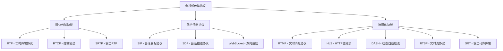

### 2.2 RTP (Real-time Transport Protocol)

#### 2.2.1 核心机制

**协议定位**
- 应用层协议，运行于UDP之上
- 专为实时数据传输设计，不保证可靠性
- 提供时间戳、序列号、载荷类型标识

**报文结构**

| 字段 | 长度(bit) | 作用 |
|------|----------|------|
| Version (V) | 2 | RTP版本号，当前为2 |
| Padding (P) | 1 | 填充标志 |
| Extension (X) | 1 | 扩展头标志 |
| CSRC Count (CC) | 4 | CSRC标识符数量 |
| Marker (M) | 1 | 标记位，帧边界识别 |
| Payload Type (PT) | 7 | 载荷类型(音频/视频编码) |
| Sequence Number | 16 | 序列号，检测丢包与乱序 |
| Timestamp | 32 | 时间戳，同步与抖动计算 |
| SSRC | 32 | 同步源标识符 |
| CSRC | 32*CC | 贡献源标识符列表 |

**时间戳机制**
- 时间戳单位由采样率决定（音频常用90kHz，视频使用编码时钟）
- 用于接收端的播放同步与抖动缓冲
- 同一帧的多个RTP包共享相同时间戳

**序列号机制**
- 每发送一个RTP包，序列号加1
- 接收端通过序列号检测丢包（Gap）与乱序（Out-of-order）
- 支持循环使用（16位，0-65535）

#### 2.2.2 应用场景

| 场景类型 | 优势 | 劣势 |
|---------|------|------|
| 实时音视频通话 | 低延迟、时间戳精准 | 无拥塞控制，需配合RTCP |
| WebRTC通信 | 标准化、浏览器原生支持 | 需要SRTP加密，配置复杂 |
| IPTV直播 | 组播支持、低开销 | 公网丢包无重传 |

#### 2.2.3 关键优化技术

**抖动缓冲(Jitter Buffer)**
- 通过时间戳计算网络抖动
- 动态调整缓冲区大小（通常20-200ms）
- 平衡延迟与流畅性

**FEC前向纠错**
- 冗余编码方案：XOR、Reed-Solomon
- 冗余率通常5%-20%
- 在丢包率<10%时有效恢复

**NACK重传**
- 通过RTCP反馈请求重传
- 适用于低延迟场景（RTT<100ms）
- 需要发送端维护发送缓存

### 2.3 RTCP (RTP Control Protocol)

#### 2.3.1 核心机制

**协议职责**
- 质量反馈：丢包率、抖动、往返时延(RTT)
- 源标识：CNAME唯一标识，跨会话关联
- 会话控制：成员加入/离开通知
- 带宽控制：RTCP占用RTP总带宽的5%

**报文类型**

| 类型 | 名称 | 用途 |
|------|------|------|
| SR | Sender Report | 发送端统计：发送包数、字节数、时间戳映射 |
| RR | Receiver Report | 接收端统计：丢包率、抖动、上次SR时延 |
| SDES | Source Description | 源描述信息：CNAME、NAME、EMAIL |
| BYE | Goodbye | 会话结束通知 |
| APP | Application Defined | 应用自定义扩展 |

**传输质量指标计算**

丢包率计算模型：
- Expected Packets = Highest Sequence - Initial Sequence + 1
- Lost Packets = Expected Packets - Received Packets
- Loss Fraction = (Lost Packets / Expected Packets) × 256

抖动计算模型：
- Interarrival Jitter = J(i) = J(i-1) + (|D(i-1,i)| - J(i-1)) / 16
- D(i-1,i) = (Arrival_i - Timestamp_i) - (Arrival_{i-1} - Timestamp_{i-1})

#### 2.3.2 应用场景

**自适应码率控制**
- 接收端通过RR报告网络质量
- 发送端根据丢包率、RTT调整编码码率
- GCC（Google Congestion Control）算法核心依赖RTCP反馈

**音视频同步**
- 通过SR中的NTP时间戳与RTP时间戳映射
- 计算音视频流的时间差，动态调整播放速度

**网络诊断**
- RTT测量：记录SR发送时间，RR中携带DLSR（Delay Since Last SR）
- 单向延迟估算：需要NTP时钟同步

### 2.4 RTMP (Real-Time Messaging Protocol)

#### 2.4.1 核心机制

**协议特性**
- 基于TCP，保证可靠传输
- 默认端口1935
- 支持CDN分发，行业标准推流协议
- Adobe开发，Flash时代主流协议

**握手流程**

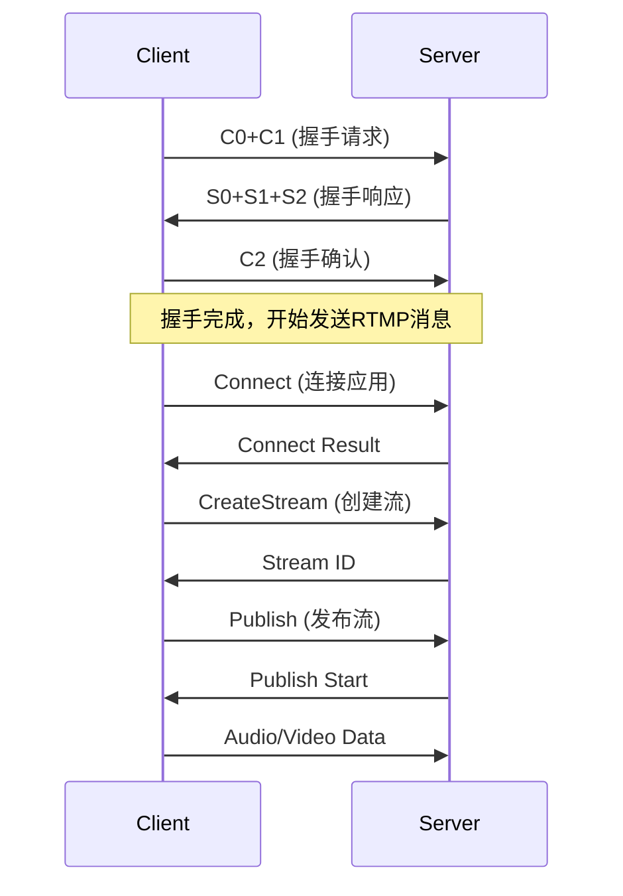

**分块传输(Chunking)**
- 默认块大小128字节，可协商调整
- 避免大消息阻塞小消息（如音频）
- 分块头包含时间戳、消息长度、类型

**消息类型**

| Type ID | 消息类型 | 用途 |
|---------|---------|------|
| 1 | Set Chunk Size | 设置块大小 |
| 3 | Acknowledgement | 确认收到字节数 |
| 4 | User Control | 流控制：Stream Begin/EOF |
| 5 | Window Ack Size | 窗口大小设置 |
| 8 | Audio | 音频数据 |
| 9 | Video | 视频数据 |
| 18 | Metadata | AMF格式元数据 |

#### 2.4.2 应用场景

| 场景 | 优势 | 局限性 |
|------|------|-------|
| 直播推流(OBS→CDN) | 稳定、CDN支持好、延迟低(1-3s) | 需TCP，移动网络切换断流 |
| 互动直播连麦 | 配合WebRTC使用 | 单向协议，不适合双向通信 |
| 录制与转码 | 元数据丰富(分辨率、码率) | Flash淘汰，浏览器不支持 |

#### 2.4.3 优化技术

**TCP参数调优**
- 禁用Nagle算法（TCP_NODELAY），降低延迟
- 增大发送/接收缓冲区（SO_SNDBUF/SO_RCVBUF）
- 快速重传与选择性确认（SACK）

**GOP缓存**
- 缓存最近一个完整GOP（Group of Pictures）
- 新观众加入时立即发送，减少首帧等待
- 通常缓存1-2秒视频数据

### 2.5 HLS (HTTP Live Streaming)

#### 2.5.1 核心机制

**协议架构**
- Apple开发，HTTP协议承载
- 媒体切片：TS/fMP4格式，通常2-10秒一个切片
- M3U8索引文件：播放列表，动态更新

**M3U8播放列表结构**

主播放列表（Master Playlist）：
- 多码率、多分辨率的流索引
- 客户端根据网络状况自动切换

媒体播放列表（Media Playlist）：
- 包含媒体切片的URL、时长、序列号
- 支持直播（动态更新）与点播（静态列表）

**关键标签**

| 标签 | 作用 | 示例 |
|------|------|------|
| #EXTM3U | 文件头标识 | 必须在首行 |
| #EXT-X-VERSION | 协议版本 | #EXT-X-VERSION:3 |
| #EXT-X-TARGETDURATION | 最大切片时长 | #EXT-X-TARGETDURATION:10 |
| #EXT-X-MEDIA-SEQUENCE | 起始序列号 | 直播时递增 |
| #EXTINF | 切片时长 | #EXTINF:9.9, |
| #EXT-X-STREAM-INF | 流信息 | BANDWIDTH、RESOLUTION |
| #EXT-X-ENDLIST | 结束标记 | 点播必需 |

#### 2.5.2 应用场景

| 场景 | 优势 | 劣势 |
|------|------|------|
| 大规模直播分发 | CDN友好、HTTP穿透防火墙 | 延迟高(10-30s) |
| iOS/Safari播放 | 原生支持，无需插件 | 非Apple平台需hls.js |
| 自适应码率(ABR) | 多码率自动切换，观看流畅 | 切换有延迟 |

#### 2.5.3 优化技术

**LL-HLS (Low-Latency HLS)**
- 切片时长降至1秒以下
- Partial Segments：0.2-0.5秒的部分切片
- 预加载提示(Preload Hints)，提前请求下一切片
- 延迟可降至2-3秒

**自适应码率策略**
- 带宽估算：测量下载速度，预测网络容量
- 缓冲区监控：缓冲不足降低码率，充足提高码率
- 平滑切换：避免频繁切换引起的卡顿

### 2.6 SIP (Session Initiation Protocol)

#### 2.6.1 核心机制

**协议定位**
- IETF标准化的信令协议（RFC 3261）
- 基于文本的请求/响应模型，类似HTTP
- 负责会话的建立、修改、终止
- 不传输媒体数据，需配合RTP/RTCP

**消息结构**

请求方法：
| 方法 | 用途 |
|------|------|
| INVITE | 发起会话邀请 |
| ACK | 确认INVITE响应 |
| BYE | 终止会话 |
| CANCEL | 取消正在进行的请求 |
| REGISTER | 注册用户位置 |
| OPTIONS | 查询服务器能力 |

响应代码：
| 类别 | 含义 | 示例 |
|------|------|------|
| 1xx | 临时响应 | 100 Trying, 180 Ringing |
| 2xx | 成功 | 200 OK |
| 3xx | 重定向 | 302 Moved Temporarily |
| 4xx | 客户端错误 | 404 Not Found, 486 Busy Here |
| 5xx | 服务器错误 | 503 Service Unavailable |
| 6xx | 全局失败 | 603 Decline |

**会话建立流程**

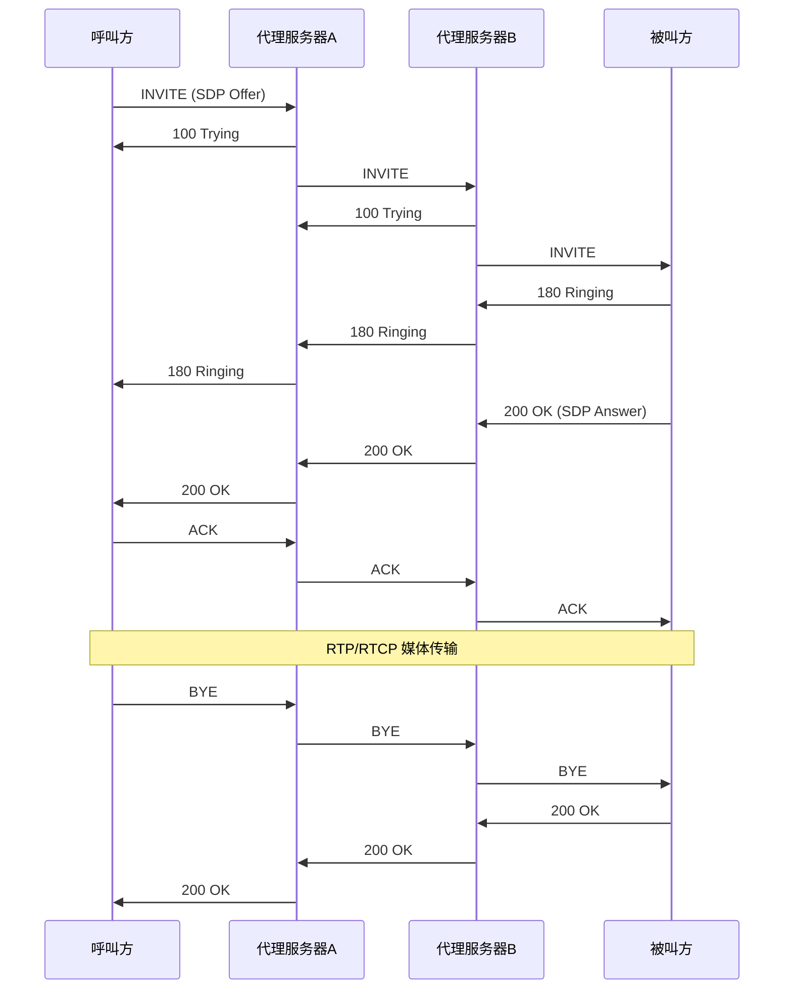

**SDP (Session Description Protocol)**
- 描述媒体会话参数：媒体类型、编解码器、IP地址、端口
- 嵌入在SIP消息体中
- Offer/Answer模型：协商双方能力

#### 2.6.2 应用场景

| 场景 | 特点 | 典型应用 |
|------|------|---------|
| VoIP电话系统 | 标准化、运营商级 | 企业PBX、软交换 |
| 视频会议 | 多方通话、会议控制 | MCU服务器信令 |
| IMS网络 | 电信级可靠性、计费 | 4G/5G语音(VoLTE) |

#### 2.6.3 关键技术

**NAT穿越**
- STUN：检测NAT类型与公网地址
- TURN：中继服务器转发媒体
- ICE：综合策略，优先P2P，失败则中继

**安全机制**
- TLS传输加密（SIP over TLS，端口5061）
- 摘要认证（Digest Authentication）
- SRTP媒体加密

### 2.7 RTSP (Real-Time Streaming Protocol)

#### 2.7.1 核心机制

**协议特性**
- 应用层协议，控制媒体流的传输
- 类HTTP的请求/响应模型
- 支持组播与单播
- 常用于监控摄像头、IPTV点播

**方法定义**

| 方法 | 作用 |
|------|------|
| DESCRIBE | 获取媒体描述(SDP) |
| SETUP | 建立传输会话，协商RTP/RTCP端口 |
| PLAY | 开始传输，可指定Range |
| PAUSE | 暂停传输 |
| TEARDOWN | 终止会话，释放资源 |
| GET_PARAMETER | 获取参数状态 |
| SET_PARAMETER | 设置参数 |

**交互流程**

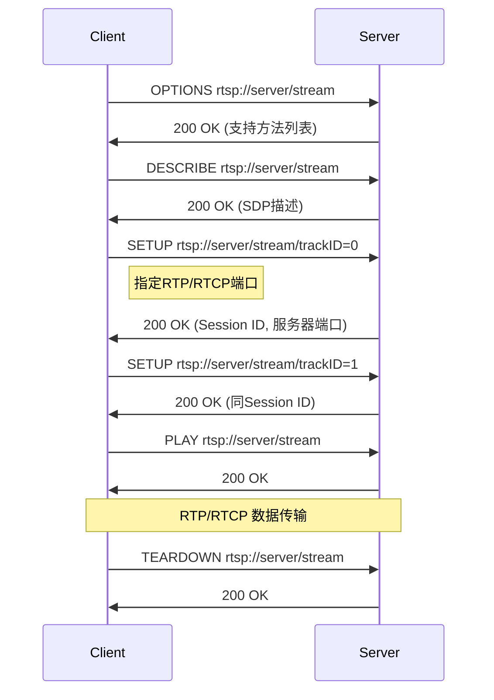

**传输模式**

| 模式 | 特点 | 适用场景 |
|------|------|---------|
| RTP/UDP | 低延迟，可能丢包 | 局域网监控 |
| RTP/TCP Interleaved | 可靠，穿透NAT，延迟略高 | 公网传输 |
| RTP/RTCP Multicast | 单播一份，多人接收 | IPTV直播 |

#### 2.7.2 应用场景

| 场景 | 优势 | 局限性 |
|------|------|-------|
| IP摄像头监控 | 低延迟、精确控制(PTZ) | 需专用播放器 |
| 视频点播(VoD) | 支持Seek、暂停 | CDN支持不如HLS |
| 教育录播系统 | 多轨道（教师、学生、课件）同步 | 防火墙穿透困难 |

### 2.8 SRT (Secure Reliable Transport)

#### 2.8.1 核心机制

**协议定位**
- 基于UDT（UDP-based Data Transfer）
- 开源协议，Haivision主导开发
- 专为弱网、远距离传输优化
- 提供加密、低延迟、丢包恢复

**核心技术**

ARQ (Automatic Repeat reQuest)：
- 选择性重传（类似TCP SACK）
- 动态调整重传超时时间（RTO）
- 重传请求通过NAK（Negative Acknowledgement）

FEC (Forward Error Correction)：
- 可选的冗余编码
- 与ARQ互补，降低重传延迟

拥塞控制：
- 基于延迟的算法，避免缓冲区膨胀
- 动态调整发送速率

加密：
- AES-128/256加密
- 密钥交换支持预共享密钥或动态协商

**延迟模式**

| 模式 | 延迟范围 | 适用场景 |
|------|---------|---------|
| Live | 120-8000ms | 直播推流，平衡延迟与质量 |
| File | 无延迟限制 | 文件传输，优先可靠性 |

#### 2.8.2 应用场景

| 场景 | 优势 | 对比RTMP |
|------|------|---------|
| 远距离直播(跨洲) | 丢包恢复好，抗抖动 | RTMP易断流 |
| 弱网环境(4G/5G) | 延迟可控，质量稳定 | RTMP卡顿明显 |
| 贡献级传输(ENG) | 端到端加密，低延迟 | RTMP无加密 |

### 2.9 WebRTC

#### 2.9.1 核心机制

**技术栈**
- 媒体传输：RTP/RTCP + SRTP
- 信令：自定义（常用WebSocket + SDP）
- NAT穿越：ICE（STUN + TURN）
- 拥塞控制：GCC（Google Congestion Control）

**连接建立流程**

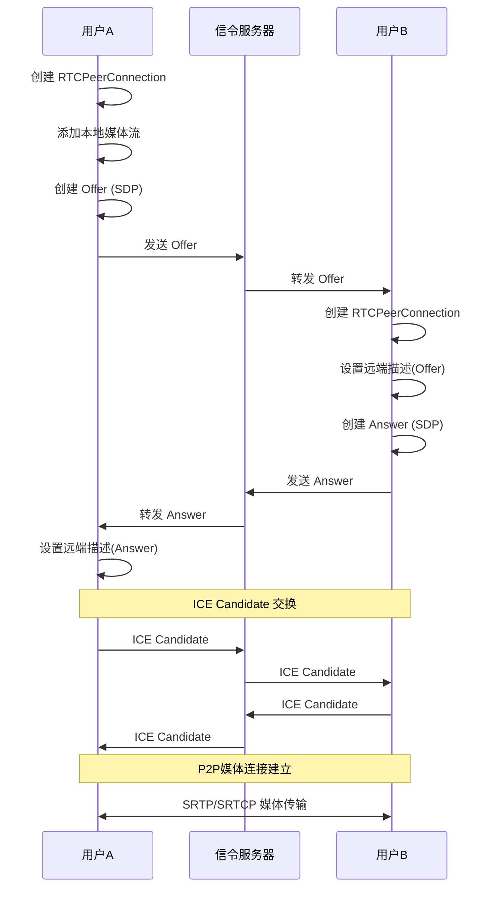

**拥塞控制(GCC)**
- 基于延迟的估算：测量单向延迟梯度
- 基于丢包的估算：RTCP反馈丢包率
- 动态调整发送码率，匹配网络容量

#### 2.9.2 应用场景

| 场景 | 特点 | 技术要点 |
|------|------|---------|
| 1v1视频通话 | 超低延迟(<300ms)、P2P传输 | ICE直连 |
| 多人会议 | SFU转发、大小流 | 服务端选择转发 |
| 屏幕共享 | 高分辨率、低帧率 | 独立编码参数 |
| 云游戏 | 超低延迟、高码率 | H.264 low-latency tune |

#### 2.9.3 关键优化

**大小流(Simulcast)**
- 发送端同时编码多个分辨率/码率
- 接收端根据网络与UI需求选择
- 典型配置：1080p、720p、360p

**SVC (Scalable Video Coding)**
- 单流包含多层（时间层、空间层、质量层）
- 服务器可丢弃高层，降低带宽
- VP9、AV1支持较好

**Jitter Buffer 自适应**
- 基于网络抖动动态调整
- NetEQ算法（音频）：时间伸缩、丢包隐藏
- 延迟范围20-500ms

## 3. 协议综合对比矩阵

### 3.1 技术特性对比

| 协议 | 传输层 | 可靠性 | 延迟 | NAT穿透 | 加密 | 标准化程度 |
|------|-------|--------|------|---------|------|-----------|
| RTP/RTCP | UDP | 不可靠 | 极低(<100ms) | 需ICE | 需SRTP | IETF标准 |
| RTMP | TCP | 可靠 | 低(1-3s) | 困难 | RTMPE(弱) | 事实标准 |
| HLS | HTTP/TCP | 可靠 | 高(10-30s) | 优秀 | HTTPS | IETF标准 |
| DASH | HTTP/TCP | 可靠 | 高(10-30s) | 优秀 | HTTPS | ISO标准 |
| SIP | TCP/UDP | 可配置 | 仅信令 | 需辅助 | TLS | IETF标准 |
| RTSP | TCP | 可靠 | 低(<500ms) | 困难 | 部分支持 | IETF标准 |
| SRT | UDP | 可靠 | 低(0.12-8s) | 较好 | AES内置 | 开源标准 |
| WebRTC | UDP | 选择性重传 | 极低(<300ms) | ICE优秀 | SRTP强制 | W3C标准 |

### 3.2 应用场景适配矩阵

| 场景需求 | 首选协议 | 备选方案 | 不推荐 |
|---------|---------|---------|--------|
| 超低延迟通话(<500ms) | WebRTC | RTP/RTCP | HLS、RTMP |
| 直播推流 | RTMP/SRT | WebRTC | HLS |
| 大规模直播分发 | HLS/DASH | RTMP(CDN) | WebRTC、RTP |
| 监控视频 | RTSP | HLS | RTMP |
| 会议信令 | SIP/WebSocket | 自定义TCP | 无 |
| 远距离传输 | SRT | RTMP | WebRTC(跨洲) |
| 移动网络 | WebRTC/SRT | HLS | RTSP |
| 弱网环境 | SRT | WebRTC | RTMP、HLS |

### 3.3 性能指标对比

| 协议 | 首包延迟 | 端到端延迟 | 丢包容忍 | CPU占用 | 带宽效率 |
|------|---------|-----------|---------|---------|---------|
| RTP/RTCP | 低 | <200ms | 低(需FEC) | 低 | 高 |
| RTMP | 中 | 1-3s | 高(TCP) | 中 | 中 |
| HLS | 高 | 10-30s | 高(HTTP) | 低 | 低(切片开销) |
| SRT | 中 | 0.5-3s | 极高 | 中 | 高 |
| WebRTC | 低 | <500ms | 中(NACK+FEC) | 高(编解码) | 高 |

## 4. 可扩展底层协议框架设计

### 4.1 设计原则

#### 4.1.1 分层解耦原则

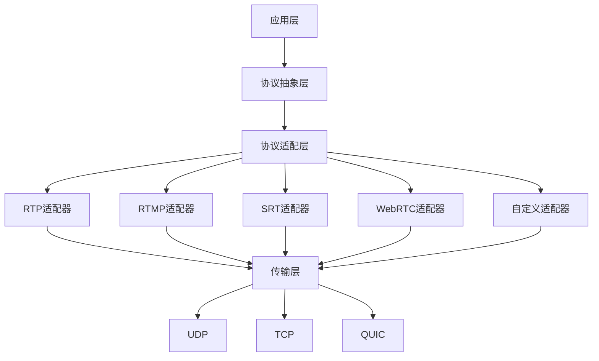

**层次职责**

| 层次 | 职责 | 对外接口 |
|------|------|---------|
| 应用层 | 业务逻辑、UI交互 | 统一媒体API |
| 协议抽象层 | 定义协议无关接口 | IMediaTransport、ISignaling |
| 协议适配层 | 协议具体实现 | 继承抽象接口 |
| 传输层 | Socket管理、网络I/O | 发送/接收原始数据 |

#### 4.1.2 策略模式

通过策略模式实现协议的动态选择与切换，避免硬编码协议类型。

**策略选择决策树**

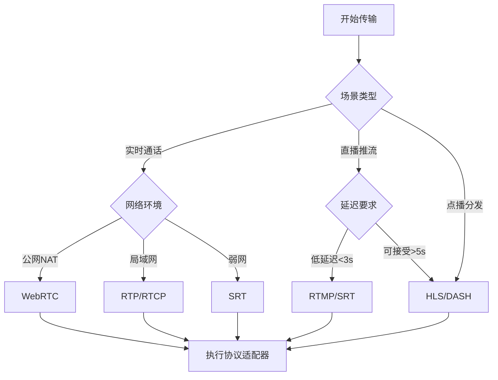

#### 4.1.3 插件化架构

支持协议的热插拔，新增协议无需修改框架核心代码。

**插件注册机制**

| 步骤 | 操作 | 说明 |
|------|------|------|
| 1 | 定义协议接口 | IProtocolPlugin |
| 2 | 实现具体协议 | RTPPlugin、RTMPPlugin |
| 3 | 注册到工厂 | ProtocolFactory.register("RTP", RTPPlugin) |
| 4 | 运行时加载 | ProtocolFactory.create("RTP") |

### 4.2 核心抽象接口设计

#### 4.2.1 媒体传输接口

**IMediaTransport 接口定义**

| 方法 | 参数 | 返回值 | 用途 |
|------|------|--------|------|
| initialize | config: TransportConfig | Result | 初始化传输参数 |
| sendMediaData | data: MediaPacket | Result | 发送媒体数据包 |
| onMediaDataReceived | callback: MediaCallback | void | 注册接收回调 |
| getTransportStats | void | TransportStats | 获取传输统计 |
| updateQoS | qos: QoSParams | Result | 更新服务质量参数 |
| close | void | Result | 关闭传输 |

**MediaPacket 数据结构**

| 字段 | 类型 | 说明 |
|------|------|------|
| payload | byte[] | 媒体载荷数据 |
| timestamp | uint64 | 时间戳(微秒) |
| mediaType | enum | 音频/视频/数据 |
| codecType | enum | 编解码器类型 |
| isKeyFrame | boolean | 是否关键帧 |
| sequenceNumber | uint32 | 序列号 |
| metadata | map<string, any> | 扩展元数据 |

**TransportStats 统计信息**

| 字段 | 类型 | 说明 |
|------|------|------|
| bytesSent | uint64 | 已发送字节数 |
| bytesReceived | uint64 | 已接收字节数 |
| packetsSent | uint64 | 已发送包数 |
| packetsLost | uint32 | 丢包数 |
| jitter | float | 抖动(毫秒) |
| rtt | float | 往返时延(毫秒) |
| bitrate | float | 实时码率(kbps) |
| lossRate | float | 丢包率(0-1) |

#### 4.2.2 信令接口

**ISignaling 接口定义**

| 方法 | 参数 | 返回值 | 用途 |
|------|------|--------|------|
| connect | serverUrl: string | Result | 连接信令服务器 |
| sendOffer | sdp: SessionDescription | Result | 发送会话邀请 |
| sendAnswer | sdp: SessionDescription | Result | 发送会话应答 |
| sendCandidate | candidate: IceCandidate | Result | 发送ICE候选 |
| onSignalReceived | callback: SignalCallback | void | 注册信令回调 |
| disconnect | void | Result | 断开信令 |

#### 4.2.3 编解码接口

**ICodec 接口定义**

| 方法 | 参数 | 返回值 | 用途 |
|------|------|--------|------|
| encode | rawFrame: VideoFrame | EncodedPacket | 编码视频帧 |
| decode | packet: EncodedPacket | VideoFrame | 解码视频包 |
| setBitrate | targetBitrate: uint32 | Result | 动态调整码率 |
| setFramerate | fps: uint32 | Result | 调整帧率 |
| requestKeyFrame | void | Result | 请求关键帧 |
| getCodecInfo | void | CodecInfo | 获取编解码器信息 |

### 4.3 协议适配器实现架构

#### 4.3.1 RTP/RTCP 适配器

**模块组成**

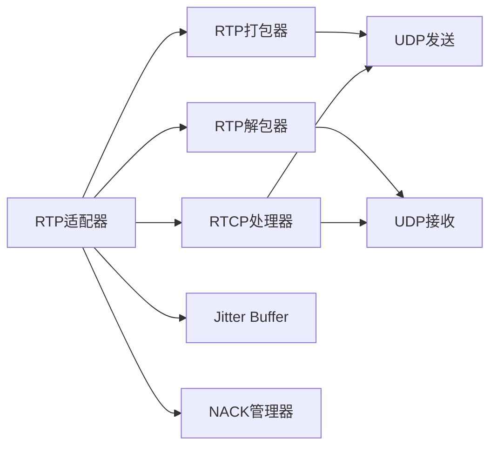

**关键功能模块**

| 模块 | 职责 | 输入 | 输出 |
|------|------|------|------|
| RTP打包器 | 媒体数据分片、添加RTP头 | MediaPacket | RTP Packets |
| RTP解包器 | 去除RTP头、重组分片 | RTP Packets | MediaPacket |
| RTCP处理器 | 生成SR/RR、处理反馈 | 统计信息 | RTCP Reports |
| Jitter Buffer | 排序、延迟平滑 | 乱序RTP包 | 有序媒体帧 |
| NACK管理器 | 检测丢包、请求重传 | 序列号Gap | NACK消息 |

**配置参数**

| 参数 | 默认值 | 可调范围 | 说明 |
|------|-------|----------|------|
| payloadType | 96 | 96-127 | 动态载荷类型 |
| ssrc | 随机 | uint32 | 同步源标识 |
| clockRate | 90000 | - | 视频时钟频率 |
| jitterBufferSize | 100ms | 20-500ms | 抖动缓冲大小 |
| nackEnabled | true | bool | 是否启用NACK |
| fecEnabled | false | bool | 是否启用FEC |

#### 4.3.2 RTMP 适配器

**模块组成**

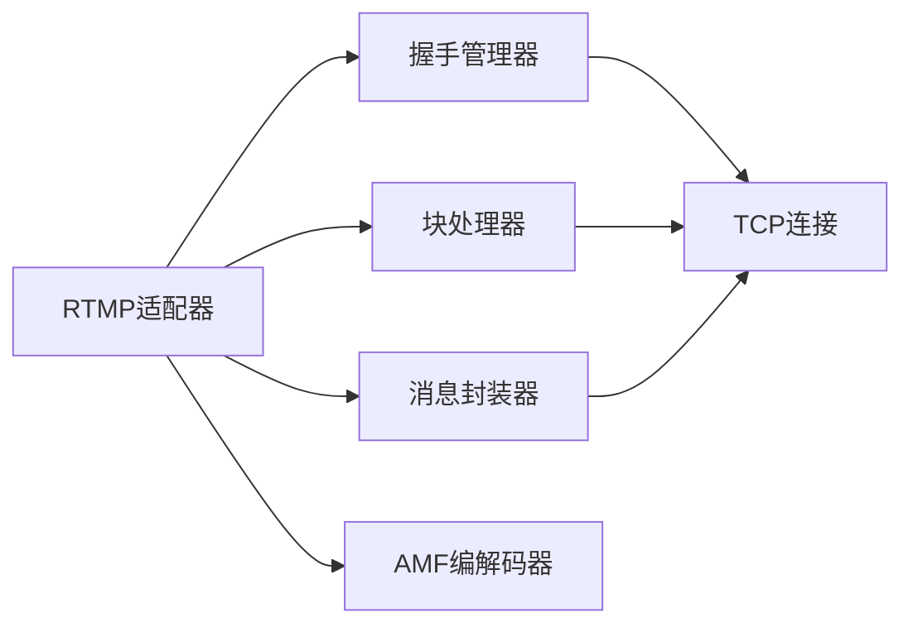

**关键功能模块**

| 模块 | 职责 |
|------|------|
| 握手管理器 | 处理C0/C1/C2握手流程 |
| 块处理器 | 消息分块与重组、块头压缩 |
| 消息封装器 | 封装Audio/Video/Metadata消息 |
| AMF编解码器 | 序列化/反序列化元数据 |

**推流流程**

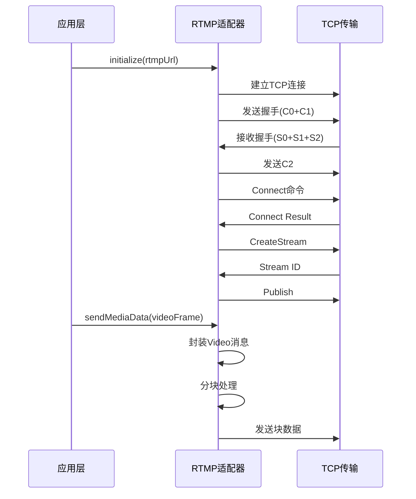

#### 4.3.3 SRT 适配器

**模块组成**

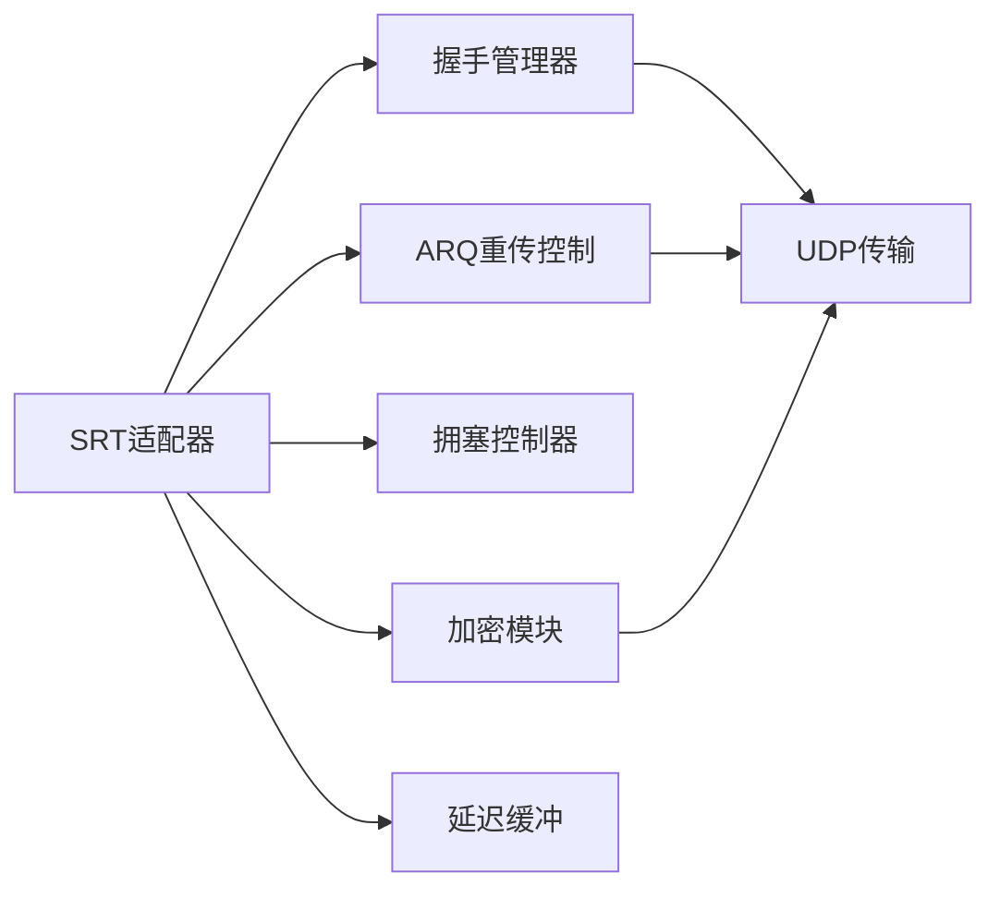

**关键功能模块**

| 模块 | 职责 | 算法 |
|------|------|------|
| ARQ重传控制 | 丢包检测、选择性重传 | NAK-based |
| 拥塞控制器 | 动态码率调整 | 基于延迟梯度 |
| 加密模块 | 数据加密/解密 | AES-128/256 |
| 延迟缓冲 | 抗抖动、顺序恢复 | 可配置延迟窗口 |

**配置参数**

| 参数 | 默认值 | 说明 |
|------|-------|------|
| latency | 120ms | 目标延迟 |
| maxBandwidth | -1 | 最大带宽(-1为无限制) |
| pbkeylen | 16 | 密钥长度(0/16/24/32) |
| passphrase | "" | 预共享密钥 |
| tlpktdrop | true | 是否丢弃过时数据包 |

#### 4.3.4 WebRTC 适配器

**模块组成**

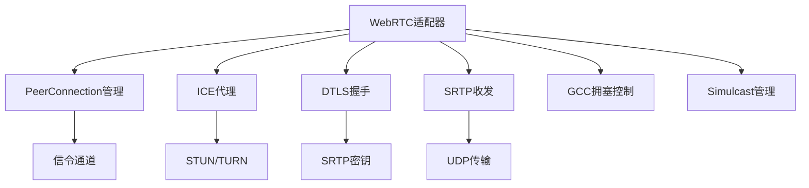

**关键功能模块**

| 模块 | 职责 |
|------|------|
| PeerConnection管理 | 管理连接状态、协商SDP |
| ICE代理 | 收集Candidate、连通性检查 |
| DTLS握手 | 建立安全通道、密钥协商 |
| SRTP收发 | 加密RTP/RTCP |
| GCC拥塞控制 | 基于延迟与丢包的码率控制 |
| Simulcast管理 | 大小流选择与切换 |

**连接状态机**

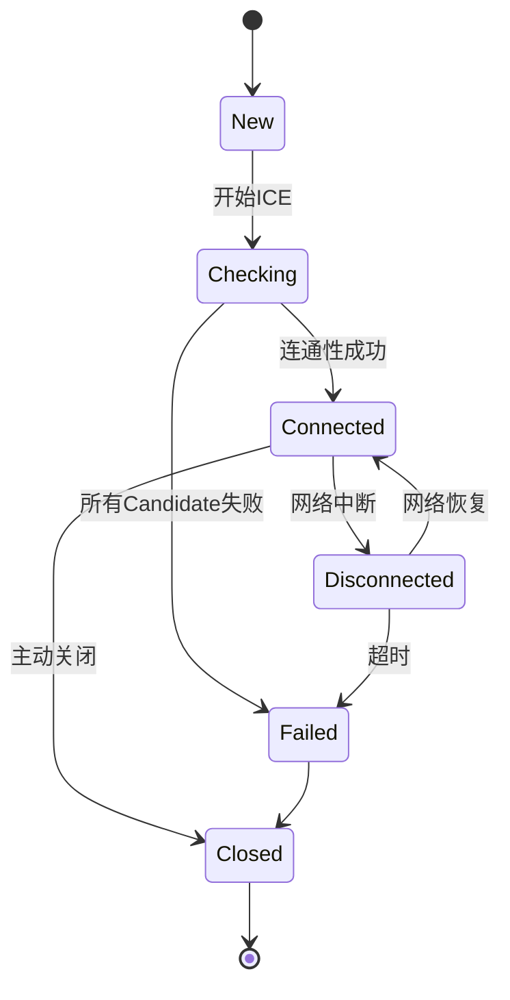

### 4.4 协议切换与降级策略

#### 4.4.1 自动切换决策

**决策因子**

| 因子 | 阈值 | 触发动作 |
|------|------|---------|
| RTT | >200ms | WebRTC → SRT |
| 丢包率 | >5% | RTMP → SRT |
| 带宽 | <500kbps | 降低分辨率/切换协议 |
| Jitter | >50ms | 增大缓冲区 |
| 连接失败次数 | >3 | TCP协议(RTMP) |

**切换流程**

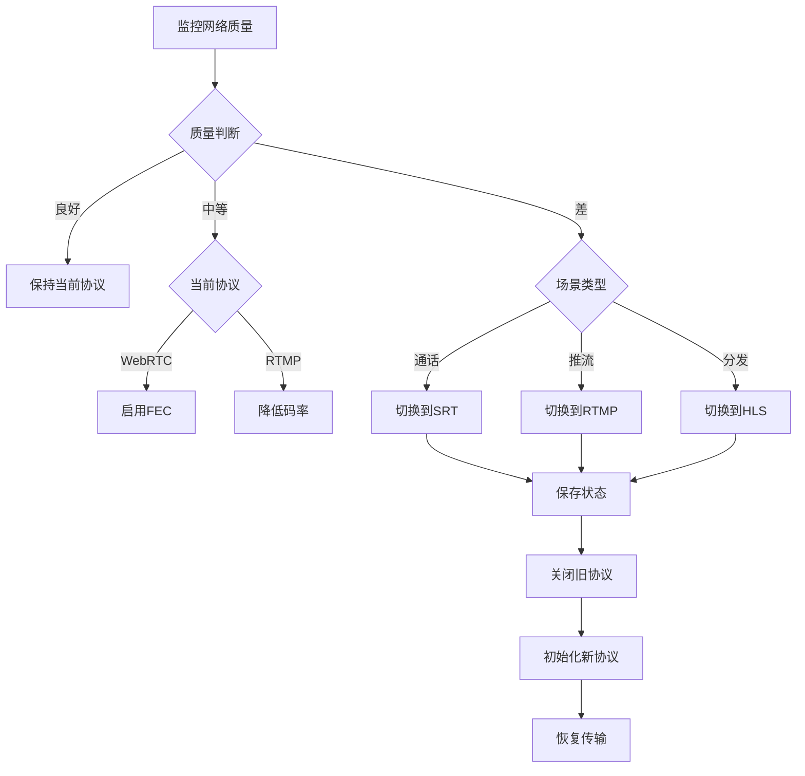

#### 4.4.2 无缝切换机制

**状态保存与恢复**

| 状态项 | 保存内容 | 用途 |
|-------|---------|------|
| 媒体时间戳 | 最后一帧的时间戳 | 新协议续传，避免跳帧 |
| 序列号 | 当前序列号 | 保持连续性 |
| 编码器状态 | 码率、帧率、GOP | 避免重新初始化 |
| 缓冲区数据 | 未发送的媒体帧 | 切换后立即发送 |

**双链路冗余传输**

在关键场景下，同时使用两种协议传输，接收端选择质量更好的流：

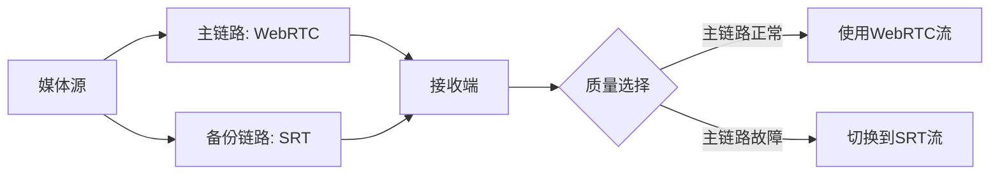

### 4.5 QoS (Quality of Service) 统一管理

#### 4.5.1 统计指标收集

**统一指标体系**

| 指标类别 | 具体指标 | 收集频率 |
|---------|---------|---------|
| 网络层 | RTT、丢包率、抖动、带宽 | 1秒 |
| 传输层 | 发送/接收字节、包数、重传率 | 1秒 |
| 应用层 | 帧率、码率、卡顿次数、首帧延迟 | 实时 |
| 用户体验 | MOS评分、缓冲时长、清晰度切换 | 5秒 |

**数据流动**

```mermaid
graph LR
    A[各协议适配器] --> B[统计收集器]
    B --> C[指标聚合器]
    C --> D[存储(时序数据库)]
    C --> E[实时分析引擎]
    E --> F[告警系统]
    E --> G[自适应策略]
    G --> A
```

#### 4.5.2 自适应优化策略

**码率自适应算法**

基于带宽估算的动态调整：

| 阶段 | 带宽状态 | 调整策略 |
|------|---------|---------|
| 探测期 | 初始连接 | 从中等码率开始，快速探测上限 |
| 稳定期 | 波动<10% | 缓慢提升码率，充分利用带宽 |
| 下降期 | 丢包率>3% | 快速降低码率，避免雪崩 |
| 恢复期 | 质量改善 | 缓慢提升码率，防止震荡 |

**FEC冗余动态调整**

| 网络质量 | 丢包率 | FEC冗余率 |
|---------|-------|----------|
| 优秀 | <1% | 0% |
| 良好 | 1-3% | 5% |
| 中等 | 3-5% | 10% |
| 较差 | 5-10% | 15% |
| 极差 | >10% | 20% + 降低码率 |

### 4.6 安全机制

#### 4.6.1 加密传输

**协议层加密支持**

| 协议 | 加密方案 | 密钥协商 |
|------|---------|---------|
| RTP | SRTP (AES-128/256) | DTLS-SRTP |
| RTMP | RTMPE (弃用) / RTMPS | TLS |
| HLS | HTTPS | TLS |
| SRT | AES-128/256 | 预共享密钥 |
| WebRTC | SRTP (强制) | DTLS |

**端到端加密(E2EE)**

在框架层实现端到端加密，独立于协议层：


#### 4.6.2 认证与鉴权

**统一认证接口**

| 方法 | 参数 | 返回值 | 用途 |
|------|------|--------|------|
| authenticate | credential: AuthInfo | Token | 用户认证 |
| authorize | token: string, resource: string | bool | 资源鉴权 |
| refreshToken | oldToken: string | Token | 令牌刷新 |

**多协议认证适配**

| 协议 | 认证机制 | 适配方式 |
|------|---------|---------|
| RTMP | 查询字符串Token | URL参数注入 |
| WebRTC | 信令层Token | SDP交换前验证 |
| SRT | Stream ID | Passphrase + Stream ID |
| HLS | Cookie/Token | M3U8 URL签名 |

### 4.7 测试策略

#### 4.7.1 单元测试

**测试覆盖范围**

| 模块 | 测试重点 |
|------|---------|
| RTP打包器 | 分片逻辑、时间戳计算、Marker位设置 |
| RTCP处理器 | SR/RR报文生成、统计计算准确性 |
| Jitter Buffer | 乱序重排、丢包检测、延迟控制 |
| RTMP握手 | 握手流程、随机数生成、摘要验证 |
| SRT ARQ | NAK生成、重传队列管理、超时处理 |

#### 4.7.2 集成测试

**跨协议互通测试**

| 场景 | 测试内容 |
|------|---------|
| WebRTC ↔ RTMP | WebRTC推流 → 媒体服务器 → RTMP拉流 |
| RTSP → HLS | IP摄像头RTSP → 转码 → HLS分发 |
| SRT → WebRTC | SRT推流 → SFU → WebRTC订阅 |

#### 4.7.3 性能测试

**压力测试指标**

| 指标 | 目标值 | 测试方法 |
|------|-------|---------|
| 并发连接数 | >10000 | 模拟大量客户端连接 |
| 单连接吞吐 | >10Mbps | 高码率视频传输 |
| CPU占用 | <50% (4核) | 1000路转码 |
| 内存占用 | <2GB (1000路) | 长时间运行监控 |
| 协议切换延迟 | <500ms | 网络状态突变测试 |

**弱网模拟测试**

| 网络条件 | 丢包率 | 延迟 | 抖动 | 期望结果 |
|---------|-------|------|------|---------|
| 优秀 | 0% | 20ms | 5ms | 无卡顿，高清播放 |
| 良好 | 1% | 50ms | 10ms | FEC恢复，偶尔降码率 |
| 中等 | 3% | 100ms | 30ms | NACK重传，降至标清 |
| 较差 | 5% | 200ms | 50ms | 频繁降码率，切换协议 |
| 极差 | 10% | 400ms | 100ms | 降至音频，或断开 |

## 5. 架构实施路线

### 5.1 第一阶段：核心框架搭建

**目标**: 建立协议抽象层与基础设施

| 任务 | 交付物 |
|------|--------|
| 定义核心接口 | IMediaTransport、ISignaling、ICodec接口文档 |
| 实现传输层 | UDP/TCP Socket封装、多路复用器 |
| 统计系统 | 统一指标收集与上报机制 |
| 配置管理 | 协议参数配置与热更新 |

### 5.2 第二阶段：协议适配器开发

**目标**: 实现主流协议支持

| 优先级 | 协议 | 理由 |
|-------|------|------|
| P0 | RTP/RTCP | 实时通信基础，WebRTC依赖 |
| P0 | WebRTC | 现代浏览器标准，生态完善 |
| P1 | RTMP | 推流事实标准，CDN兼容性好 |
| P1 | HLS | 分发广泛，iOS原生支持 |
| P2 | SRT | 弱网优化，专业场景 |
| P2 | RTSP | 监控设备标准 |

### 5.3 第三阶段：智能优化

**目标**: 自适应与自动化

| 功能 | 实现方式 |
|------|---------|
| 协议自动选择 | 基于场景与网络质量的决策引擎 |
| 动态切换 | 状态迁移与无缝过渡 |
| QoS优化 | 码率自适应、FEC动态调整 |
| 弱网增强 | Jitter Buffer优化、ARQ参数调优 |

### 5.4 第四阶段：生态扩展

**目标**: 开放平台与生态建设

| 方向 | 内容 |
|------|------|
| SDK封装 | iOS/Android/Web/Windows多平台SDK |
| 协议插件市场 | 第三方协议适配器注册与分发 |
| 监控平台 | 可视化质量监控与告警 |
| 文档与社区 | API文档、最佳实践、示例代码 |

## 6. 关键技术挑战与解决方案

### 6.1 协议切换的状态一致性

**挑战**: 切换过程中避免数据丢失与重复

**解决方案**:
- 双写机制：切换时短暂同时向新旧协议发送数据
- 序列号映射：维护全局序列号，协议内部序列号独立
- ACK同步：等待旧协议数据确认后再关闭

### 6.2 多协议时间戳对齐

**挑战**: 不同协议时钟基准不同，音视频同步困难

**解决方案**:
- 统一时间基准：框架层使用单调时钟（微秒）
- 协议适配器负责时间戳转换（如RTP的90kHz转换）
- NTP同步：多端统一时间源

### 6.3 弱网环境下的协议选择

**挑战**: 网络波动时频繁切换导致体验下降

**解决方案**:
- 滞后策略：网络恶化立即切换，好转延迟切换
- 多因子决策：综合RTT、丢包率、抖动、带宽
- 用户偏好：允许手动固定协议，禁用自动切换

### 6.4 大规模部署的性能优化

**挑战**: 单服务器支撑大量并发连接

**解决方案**:
- 零拷贝技术：用户态与内核态数据共享
- 协程/异步I/O：非阻塞网络处理
- 连接池复用：减少握手开销
- 硬件加速：利用GPU进行编解码与加密

## 7. 参考资料

### 7.1 标准文档

| 协议 | 标准编号 | 标题 |
|------|---------|------|
| RTP | RFC 3550 | RTP: A Transport Protocol for Real-Time Applications |
| RTCP | RFC 3550 | (同RTP) |
| SRTP | RFC 3711 | The Secure Real-time Transport Protocol |
| SDP | RFC 4566 | SDP: Session Description Protocol |
| SIP | RFC 3261 | SIP: Session Initiation Protocol |
| RTSP | RFC 7826 | Real-Time Streaming Protocol Version 2.0 |
| HLS | RFC 8216 | HTTP Live Streaming |
| WebRTC | W3C CR | WebRTC 1.0: Real-Time Communication Between Browsers |
| ICE | RFC 8445 | Interactive Connectivity Establishment |
| STUN | RFC 8489 | Session Traversal Utilities for NAT |
| TURN | RFC 8656 | Traversal Using Relays around NAT |

### 7.2 开源项目参考

| 项目 | 协议支持 | 特点 |
|------|---------|------|
| FFmpeg | 全协议支持 | 编解码与协议处理的瑞士军刀 |
| WebRTC Native | WebRTC | Google官方实现，生产级质量 |
| SRS | RTMP/HLS/WebRTC | 国产流媒体服务器，高性能 |
| MediaSoup | WebRTC SFU | Node.js实现，灵活可扩展 |
| GStreamer | 全协议 | 管道式多媒体框架 |
| libsrt | SRT | SRT协议官方库 |

### 7.3 技术博客与论文

| 主题 | 来源 | 关键内容 |
|------|------|---------|
| GCC算法详解 | Google WebRTC团队 | 基于延迟的拥塞控制 |
| HLS低延迟优化 | Apple WWDC | LL-HLS技术细节 |
| SRT vs RTMP | Haivision白皮书 | 弱网环境对比测试 |
| Jitter Buffer算法 | WebRTC源码分析 | NetEQ实现原理 |
| 大规模WebRTC架构 | Jitsi技术博客 | SFU架构设计 |
