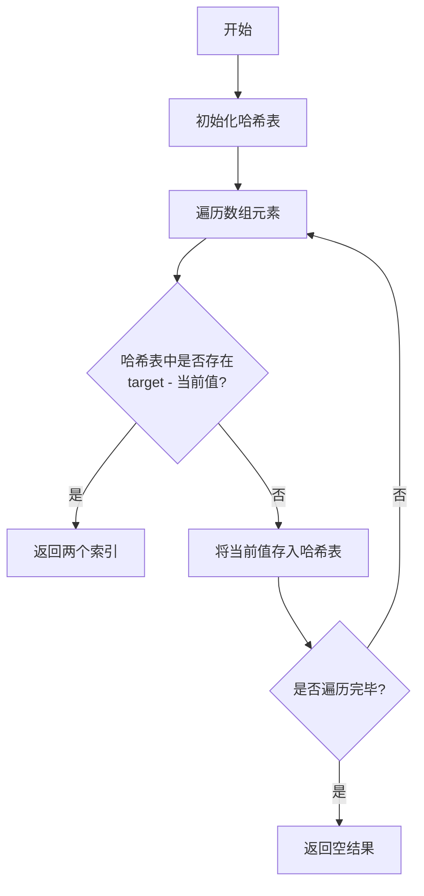
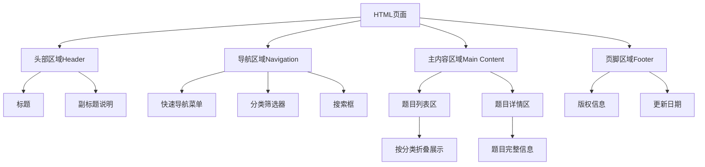
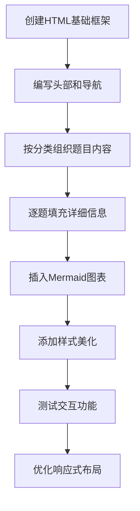

# 50道常见面试算法题集合设计文档

## 1. 概述

### 1.1 项目定位
本项目旨在构建一份系统化、结构化的算法面试题集合文档，以静态HTML页面形式呈现，供个人学习和面试复习使用。题目精选自LeetCode、牛客网及其他算法平台的高频面试题，覆盖主流数据结构与算法类型。

### 1.2 核心价值
- **精准覆盖**：聚焦50道最高频的面试算法题，避免题海战术
- **系统分类**：按照数据结构和算法类型进行科学分类
- **深度解析**：每道题包含问题描述、解题思路、复杂度分析和实现方案
- **友好展示**：采用静态HTML页面，支持离线访问，适合打印和分享

### 1.3 目标用户
- 准备技术面试的求职者
- 需要系统复习算法基础的开发者
- 自学数据结构与算法的学生

## 2. 题目分类架构

### 2.1 分类策略

基于LeetCode高频题统计和CodeTop面经数据分析，本项目采用二维分类体系：

#### 2.1.1 数据结构维度（7大类）
按照题目主要使用的数据结构进行分类，便于针对性学习和复习。

| 数据结构类别 | 题目数量 | 难度分布 | 学习优先级 |
|------------|---------|---------|-----------|
| 数组 | 6题 | 简单2题、中等3题、困难1题 | 高 |
| 链表 | 8题 | 简单3题、中等4题、困难1题 | 高 |
| 二叉树 | 9题 | 简单3题、中等5题、困难1题 | 高 |
| 栈与队列 | 4题 | 简单2题、中等2题 | 中 |
| 哈希表 | 5题 | 简单2题、中等2题、困难1题 | 高 |
| 字符串 | 5题 | 简单2题、中等3题 | 中 |
| 堆 | 2题 | 中等2题 | 中 |

#### 2.1.2 算法思想维度（8大类）
按照解题所需的算法思维模式进行分类，强化算法思维训练。

| 算法类别 | 题目数量 | 核心思想 | 应用场景 |
|---------|---------|---------|---------|
| 双指针 | 3题 | 通过两个指针协同移动优化时间复杂度 | 数组、链表、字符串查找 |
| 滑动窗口 | 3题 | 维护一个动态区间，优化子串/子数组问题 | 连续子序列问题 |
| 二分查找 | 5题 | 在有序空间中快速定位目标 | 搜索、查找边界 |
| 排序 | 3题 | 数据有序化的基础算法 | 数据预处理 |
| 深度优先搜索（DFS） | 2题 | 深入探索所有可能路径 | 树、图遍历 |
| 广度优先搜索（BFS） | 2题 | 按层次逐步扩展搜索范围 | 最短路径、层级遍历 |
| 回溯法 | 5题 | 试探性搜索并可回退的枚举策略 | 排列组合、子集生成 |
| 动态规划 | 11题 | 利用子问题最优解构建全局最优解 | 优化问题、计数问题 |

### 2.2 题目选择标准

#### 2.2.1 高频性要求
- 必须在主流面经平台（LeetCode、牛客、CodeTop）中出现频率≥50次
- 至少被3家以上知名互联网公司考察过

#### 2.2.2 代表性要求
- 每种数据结构/算法类型都要有经典代表题
- 覆盖该类型的核心考点和常见变形

#### 2.2.3 难度梯度要求
- 简单：中等：困难 ≈ 3:6:1
- 确保学习曲线平滑，适合渐进式学习

## 3. 题目内容结构设计

### 3.1 单题信息架构

每道算法题包含以下结构化信息模块：

#### 3.1.1 题目元信息
| 字段名称 | 说明 | 示例 |
|---------|------|------|
| 题目编号 | 题目在本文档中的唯一标识 | T001 |
| 题目名称 | 题目的官方名称（中文） | 两数之和 |
| 难度等级 | 简单/中等/困难 | 简单 |
| 来源平台 | LeetCode/牛客/剑指Offer等 | LeetCode 1 |
| 标签分类 | 数据结构标签 + 算法标签 | 数组、哈希表 |
| 高频指数 | 在面试中出现的频率（1-5星） | ⭐⭐⭐⭐⭐ |

#### 3.1.2 题目描述
- **问题陈述**：清晰描述问题需求
- **输入说明**：输入数据的格式和约束条件
- **输出说明**：期望的返回结果格式
- **示例用例**：至少包含2-3个示例，涵盖常规情况和边界情况
- **数据范围**：明确数据规模和边界条件

#### 3.1.3 解题分析
采用四层递进式分析结构：

**第一层：问题理解**
- 问题的本质是什么
- 需要解决的核心矛盾
- 可能的陷阱和边界情况

**第二层：思路探索**
- 暴力解法思路（如果存在）
- 暴力解法的时间/空间复杂度
- 优化思路和突破点

**第三层：最优解方案**
- 采用的数据结构
- 算法策略和核心步骤
- 关键技巧和优化点

**第四层：复杂度分析**
| 复杂度类型 | 分析结果 | 说明 |
|-----------|---------|------|
| 时间复杂度 | O(n) | 需要遍历一次数组 |
| 空间复杂度 | O(n) | 使用哈希表存储n个元素 |

#### 3.1.4 解决方案展示

**方案结构**
- 算法步骤的自然语言描述（编号列表形式）
- 关键逻辑的流程图（Mermaid图表）
- 伪代码描述（非特定语言的逻辑表达）

**伪代码示例格式**
```
算法名称(输入参数):
    步骤1: 初始化数据结构
    步骤2: 遍历处理逻辑
        如果 条件A:
            执行操作X
        否则:
            执行操作Y
    步骤3: 返回结果
```

**流程图示例**
使用Mermaid语法绘制算法流程，例如：



#### 3.1.5 相关题目推荐
- 同类型的变形题目
- 进阶难度题目
- 前置基础题目

### 3.2 知识点关联设计

为每个知识点建立题目索引，方便按知识点查找：

| 知识点名称 | 相关题目编号 | 学习顺序建议 |
|-----------|-------------|-------------|
| 快慢指针 | T005, T011, T013 | 先T005，再T011，最后T013 |
| 二叉树遍历 | T021, T022, T023, T024 | 按编号顺序 |
| 动态规划-线性DP | T041, T042, T045 | 按编号顺序 |

## 4. HTML展示层设计

### 4.1 页面架构

采用单页面应用（SPA）结构，所有内容集成在一个HTML文件中，便于离线使用和分享。

#### 4.1.1 页面布局结构



#### 4.1.2 页面区域功能定义

| 区域名称 | 功能描述 | 交互行为 |
|---------|---------|---------|
| 头部区域 | 展示文档标题、统计信息 | 固定在页面顶部 |
| 导航区域 | 提供分类导航、快速跳转 | 点击分类跳转到对应题目区 |
| 主内容区 | 展示所有题目的详细内容 | 支持折叠/展开 |
| 页脚区域 | 版权、更新信息 | 固定在页面底部 |

### 4.2 视觉设计规范

#### 4.2.1 色彩系统

| 用途 | 色彩方案 | 应用场景 |
|------|---------|---------|
| 主色调 | 深蓝色系 | 标题、导航栏 |
| 辅助色 | 浅灰色系 | 背景、分隔线 |
| 强调色-简单 | 绿色 | 简单难度标签 |
| 强调色-中等 | 橙色 | 中等难度标签 |
| 强调色-困难 | 红色 | 困难难度标签 |
| 文字色 | 深灰色 | 正文内容 |
| 链接色 | 蓝色 | 超链接、题目来源 |

#### 4.2.2 排版规范

| 元素类型 | 字体大小 | 行高 | 间距 |
|---------|---------|------|------|
| 一级标题 | 28px | 1.5 | 上下各20px |
| 二级标题 | 22px | 1.4 | 上下各15px |
| 三级标题 | 18px | 1.3 | 上下各10px |
| 正文 | 14px | 1.6 | 段落间10px |
| 伪代码 | 13px | 1.5 | 使用等宽字体 |
| 表格内容 | 13px | 1.4 | 单元格内边距8px |

### 4.3 内容组织策略

#### 4.3.1 首屏内容
- 文档标题和简介
- 题目总数统计（50题）
- 分类统计概览（饼图或表格形式）
- 难度分布统计
- 快速导航菜单

#### 4.3.2 分类展示方式
采用手风琴式折叠面板，每个分类为一个独立面板：

**展示层级**
```
├── 数据结构分类
│   ├── 数组（6题）[可折叠]
│   │   ├── T001: 两数之和 [简单]
│   │   ├── T002: 三数之和 [中等]
│   │   └── ...
│   ├── 链表（8题）[可折叠]
│   │   └── ...
│   └── ...
└── 算法思想分类
    ├── 动态规划（11题）[可折叠]
    └── ...
```

#### 4.3.3 题目卡片设计

每道题目以卡片形式呈现，包含：

**卡片头部**
- 题目编号 + 题目名称
- 难度标签（彩色徽章）
- 高频指数（星级显示）
- 展开/收起按钮

**卡片主体（折叠区域）**
- 题目描述区
- 解题分析区
- 复杂度分析表格
- 伪代码展示区
- 流程图展示区
- 相关题目链接区

### 4.4 交互功能设计

虽然是静态页面，但可通过HTML + CSS实现以下基础交互：

#### 4.4.1 折叠/展开功能
- 使用HTML的 `<details>` 和 `<summary>` 标签实现原生折叠
- 无需JavaScript即可实现展开/收起效果
- 支持多级折叠（分类折叠 + 题目详情折叠）

#### 4.4.2 锚点跳转功能
- 每个分类和题目都有唯一ID
- 导航菜单通过锚点链接实现快速跳转
- URL可携带锚点，支持分享具体题目

#### 4.4.3 打印优化
- 定义打印样式表
- 打印时自动展开所有折叠内容
- 隐藏导航等非必要元素
- 优化页面分页，避免题目跨页

### 4.5 可访问性设计

#### 4.5.1 语义化HTML
- 使用正确的HTML5语义标签（header, nav, main, article, section）
- 标题层级正确（h1, h2, h3）
- 表格使用正确的表头和表体结构

#### 4.5.2 响应式设计考虑
- 采用相对单位（em, rem, %）
- 移动端适配：导航改为汉堡菜单
- 表格在小屏幕下可横向滚动

## 5. 50道题目清单架构

### 5.1 题目分配策略

基于高频面试数据和学习价值，50道题目的分配方案如下：

#### 5.1.1 数据结构维度题目分配

**数组类（6题）**
- 两数之和（简单）- 哈希表基础应用
- 三数之和（中等）- 双指针技巧
- 合并两个有序数组（简单）- 双指针
- 搜索二维矩阵II（中等）- 二分查找变形
- 螺旋矩阵（中等）- 矩阵遍历技巧
- 接雨水（困难）- 单调栈/双指针

**链表类（8题）**
- 反转链表（简单）- 链表基础操作
- 环形链表（简单）- 快慢指针
- 合并两个有序链表（简单）- 链表合并
- 相交链表（简单）- 双指针
- 环形链表II（中等）- 快慢指针进阶
- 反转链表II（中等）- 链表反转进阶
- K个一组翻转链表（困难）- 综合应用
- 复制带随机指针的链表（中等）- 哈希表+链表

**二叉树类（9题）**
- 二叉树的前序遍历（简单）- 遍历基础
- 二叉树的中序遍历（简单）- 遍历基础
- 二叉树的层序遍历（中等）- BFS应用
- 二叉树的最大深度（简单）- 递归基础
- 对称二叉树（简单）- 递归思维
- 验证二叉搜索树（中等）- BST性质
- 二叉树的最近公共祖先（中等）- 递归进阶
- 从前序与中序遍历序列构造二叉树（中等）- 树的重建
- 二叉树中的最大路径和（困难）- 递归+全局变量

**栈与队列类（4题）**
- 有效的括号（简单）- 栈的经典应用
- 最小栈（简单）- 辅助栈设计
- 用栈实现队列（简单）- 数据结构转换
- 滑动窗口最大值（困难）- 单调队列

**哈希表类（5题）**
- 两数之和（简单）- 已在数组类
- LRU缓存机制（中等）- 哈希表+双向链表
- 最长连续序列（中等）- 哈希集合
- 多数元素（简单）- Boyer-Moore算法
- 缺失的第一个正数（困难）- 原地哈希

**字符串类（5题）**
- 无重复字符的最长子串（中等）- 滑动窗口
- 最长回文子串（中等）- 动态规划/中心扩展
- 字符串相加（简单）- 模拟
- 翻转字符串里的单词（中等）- 字符串处理
- 字符串解码（中等）- 栈的应用

**堆类（2题）**
- 数组中的第K个最大元素（中等）- 快速选择/堆
- 合并K个排序链表（困难）- 最小堆

#### 5.1.2 算法思想维度题目分配

**双指针（3题）**
- 合并两个有序数组
- 三数之和
- 接雨水

**滑动窗口（3题）**
- 无重复字符的最长子串
- 最小覆盖子串（困难）
- 滑动窗口最大值

**二分查找（5题）**
- 二分查找（简单）- 基础模板
- 搜索旋转排序数组（中等）- 旋转数组
- 寻找两个正序数组的中位数（困难）- 二分应用
- 在排序数组中查找元素的第一个和最后一个位置（中等）
- 寻找峰值（中等）

**排序（3题）**
- 快速排序（中等）- 排序算法
- 归并排序（中等）- 排序算法
- 合并区间（中等）- 排序应用

**深度优先搜索（2题）**
- 岛屿数量（中等）- DFS经典题
- 路径总和II（中等）- 树的DFS

**广度优先搜索（2题）**
- 二叉树的层序遍历
- 岛屿的最大面积（中等）

**回溯法（5题）**
- 全排列（中等）- 回溯基础
- 子集（中等）- 回溯变形
- 括号生成（中等）- 回溯应用
- 组合总和（中等）- 回溯剪枝
- 复原IP地址（中等）- 回溯综合

**动态规划（11题）**
- 爬楼梯（简单）- DP入门
- 买卖股票的最佳时机（简单）- 状态机DP
- 最大子数组和（简单）- 线性DP
- 最长递增子序列（中等）- 序列DP
- 最长回文子串（中等）- 区间DP
- 零钱兑换（中等）- 完全背包
- 最长公共子序列（中等）- 二维DP
- 不同路径（中等）- 二维DP
- 最小路径和（中等）- 二维DP
- 编辑距离（困难）- 经典DP
- 最长有效括号（困难）- DP进阶

### 5.2 题目呈现顺序

在HTML文档中，题目按以下顺序组织：

#### 5.2.1 第一部分：数据结构分类（按学习顺序）
1. 数组（6题）
2. 链表（8题）
3. 栈与队列（4题）
4. 哈希表（5题）
5. 字符串（5题）
6. 二叉树（9题）
7. 堆（2题）

#### 5.2.2 第二部分：算法思想分类（按难度递进）
1. 双指针（3题）
2. 滑动窗口（3题）
3. 二分查找（5题）
4. 排序（3题）
5. 深度优先搜索（2题）
6. 广度优先搜索（2题）
7. 回溯法（5题）
8. 动态规划（11题）

### 5.3 题目去重与索引

由于同一题目可能出现在多个分类中，采用以下策略：

**主次分类策略**
- 每道题有一个主分类（完整信息展示）
- 在其他相关分类中以引用形式出现（仅显示题目名称和跳转链接）

**索引表设计**

| 题目编号 | 题目名称 | 主分类 | 次级分类 | 页面锚点ID |
|---------|---------|-------|---------|-----------|
| T001 | 两数之和 | 哈希表 | 数组 | #t001 |
| T002 | 三数之和 | 数组 | 双指针 | #t002 |
| T015 | 无重复字符的最长子串 | 字符串 | 滑动窗口 | #t015 |

## 6. 内容质量保障

### 6.1 解题分析质量标准

#### 6.1.1 分析深度要求
- 必须包含至少2种解法（暴力解 + 优化解）
- 优化解需明确说明优化思路的来源
- 复杂度分析必须准确，并给出计算依据

#### 6.1.2 表述清晰度要求
- 使用通俗易懂的语言，避免过度学术化
- 关键步骤配有图示说明
- 伪代码层次分明，逻辑清晰

#### 6.1.3 完整性要求
- 覆盖边界情况的讨论
- 说明可能的错误点和注意事项
- 给出时间和空间的权衡分析

### 6.2 伪代码规范

#### 6.2.1 伪代码风格
- 使用中文关键字（如果、否则、当、返回）
- 采用缩进表示层级关系
- 使用清晰的变量命名
- 添加必要的注释说明

#### 6.2.2 伪代码示例模板

```
函数名称(参数列表):
    // 步骤说明
    
    // 1. 初始化阶段
    创建数据结构A
    设置变量B为初始值
    
    // 2. 主逻辑处理
    对于 集合中的每个元素 执行:
        如果 满足条件X:
            执行操作Y
            更新状态Z
        否则:
            执行备选操作W
    
    // 3. 返回结果
    返回 计算结果
```

### 6.3 流程图绘制规范

#### 6.3.1 Mermaid图表类型选择

| 算法类型 | 推荐图表类型 | 说明 |
|---------|-------------|------|
| 线性流程算法 | 流程图（graph） | 清晰展示顺序逻辑 |
| 递归算法 | 流程图 + 注释 | 标注递归调用点 |
| 状态转换算法 | 状态图（stateDiagram） | 展示状态迁移 |
| 数据结构操作 | 流程图 | 展示操作步骤 |

#### 6.3.2 流程图设计原则
- 节点数量控制在15个以内
- 关键决策点使用菱形节点
- 循环结构明确标注循环条件
- 使用不同颜色区分不同阶段（如适用）

## 7. 文档扩展性设计

### 7.1 版本迭代机制

#### 7.1.1 版本号规则
采用语义化版本号：主版本号.次版本号.修订号

- 主版本号：题目数量或结构发生重大变化
- 次版本号：新增题目或分类
- 修订号：内容修正、解析优化

#### 7.1.2 更新日志记录
在文档末尾维护更新日志表：

| 版本号 | 更新日期 | 更新内容 | 变更题目 |
|-------|---------|---------|---------|
| 1.0.0 | 2025-01-15 | 初始版本发布 | 全部50题 |
| 1.0.1 | 2025-01-20 | 优化题目T015的解析 | T015 |
| 1.1.0 | 2025-02-01 | 新增贪心算法分类 | 新增3题 |

### 7.2 内容扩展预留

#### 7.2.1 预留扩展点
- 每个分类预留扩展空间（可增加至100题）
- 可增加新的算法分类（如贪心、位运算）
- 可增加进阶题目推荐区

#### 7.2.2 模块化设计
- 每道题目独立成章节，便于增删
- 分类目录自动生成，无需手动维护
- 统计数据可自动计算更新

## 8. 文档生成流程

### 8.1 内容准备阶段


#### 8.1.1 题目来源渠道
- LeetCode官方题库
- 牛客网面试题库
- CodeTop高频统计
- 剑指Offer经典题集
- 各大公司面经整理

#### 8.1.2 信息收集清单
- [ ] 题目完整描述
- [ ] 输入输出示例
- [ ] 数据范围约束
- [ ] 题目标签分类
- [ ] 高频出现公司
- [ ] 相关题目链接

### 8.2 文档编写阶段



#### 8.2.1 内容编写顺序
1. 先完成所有题目的元信息和描述
2. 再逐题完成解题分析
3. 最后补充流程图和伪代码
4. 进行全文校对和优化

#### 8.2.2 质量检查点
- [ ] 所有题目信息完整无误
- [ ] 复杂度分析准确
- [ ] 伪代码逻辑正确
- [ ] Mermaid图表正确渲染
- [ ] 锚点链接正确跳转
- [ ] 所有分类题目数量匹配
- [ ] 难度分布符合预期

### 8.3 样式与布局实现阶段

#### 8.3.1 CSS组织结构
- 基础样式重置（Reset CSS）
- 布局样式（Layout）
- 组件样式（Components）
  - 导航栏样式
  - 卡片样式
  - 表格样式
  - 徽章样式
- 工具类样式（Utilities）
- 打印样式（Print）
- 响应式样式（Responsive）

#### 8.3.2 关键样式设计

**难度标签样式**
- 简单：绿色背景，白色文字
- 中等：橙色背景，白色文字
- 困难：红色背景，白色文字
- 圆角徽章设计，易于识别

**伪代码区域样式**
- 浅灰色背景
- 等宽字体
- 保留空格和缩进
- 边框和内边距设计

**表格样式**
- 斑马纹行背景
- 悬停高亮效果
- 边框和间距优化
- 响应式滚动

### 8.4 测试验证阶段

#### 8.4.1 功能测试
- [ ] 所有折叠/展开功能正常
- [ ] 锚点跳转准确无误
- [ ] 导航菜单点击有效
- [ ] 打印预览格式正确

#### 8.4.2 兼容性测试
- [ ] Chrome浏览器测试
- [ ] Firefox浏览器测试
- [ ] Safari浏览器测试
- [ ] Edge浏览器测试
- [ ] 移动端浏览器测试

#### 8.4.3 内容校对
- [ ] 题目描述准确
- [ ] 复杂度分析正确
- [ ] 伪代码逻辑无误
- [ ] 流程图清晰易懂
- [ ] 无错别字和格式错误

## 9. 使用指南

### 9.1 学习路径建议

#### 9.1.1 零基础学习者
**第一阶段：数据结构基础（2周）**
- 数组 → 链表 → 栈与队列 → 哈希表
- 每天2-3题，侧重简单题
- 理解数据结构的基本操作

**第二阶段：树与算法基础（2周）**
- 二叉树遍历 → 双指针 → 二分查找
- 每天2题，简单+中等
- 掌握基础算法思想

**第三阶段：进阶算法（3周）**
- 回溯 → 动态规划 → 综合题
- 每天1-2题，侧重中等题
- 深入理解算法思维

#### 9.1.2 有基础准备面试者
**快速复习模式（1周）**
- 按分类每天一个主题
- 重点关注中等和困难题
- 总结解题模板和套路

**针对性突破模式**
- 识别自己的薄弱环节
- 集中攻克某一类题型
- 举一反三，做变形题

### 9.2 文档使用技巧

#### 9.2.1 查找题目方式
- **按分类查找**：从导航栏选择数据结构或算法类型
- **按难度筛选**：在分类内按难度递进学习
- **按编号定位**：直接在URL添加锚点跳转（如 #t015）

#### 9.2.2 学习记录建议
- 在纸质打印版上标注学习日期
- 用不同颜色标注掌握程度（绿-掌握，黄-待巩固，红-未掌握）
- 记录每道题的首次用时和二次复习用时

#### 9.2.3 复习策略
- **第一次复习**：学习后3天内
- **第二次复习**：学习后1周内
- **第三次复习**：学习后1个月内
- 重点复习困难题和错误题

### 9.3 扩展学习资源

#### 9.3.1 配套资源推荐
- LeetCode题目原链接（可在线测试）
- 相关视频讲解（如适用）
- 算法可视化工具（VisualAlgo等）
- 数据结构教材参考

#### 9.3.2 进阶方向
- 完成50题后，可挑战LeetCode Hot 100
- 专项突破：如深入学习动态规划、图论
- 参加算法竞赛：LeetCode周赛、CodeForces
- 阅读经典算法书籍：《算法导论》《编程珠玑》

## 10. 技术实现要点

### 10.1 HTML结构设计

#### 10.1.1 文档头部配置
- 声明HTML5文档类型
- 设置UTF-8字符编码
- 添加viewport元标签（响应式）
- 引入Mermaid库CDN
- 定义页面元信息（标题、描述、关键词）

#### 10.1.2 关键HTML元素
- 使用 `<details>` 和 `<summary>` 实现折叠
- 使用 `<table>` 展示结构化数据
- 使用 `<pre>` 和 `<code>` 展示伪代码
- 使用 `<div class="mermaid">` 嵌入流程图

### 10.2 CSS样式技术

#### 10.2.1 布局技术
- Flexbox实现导航栏布局
- Grid实现题目卡片网格（可选）
- 固定定位实现导航栏吸顶
- 相对定位实现锚点偏移校正

#### 10.2.2 美化技术
- 盒阴影增强卡片层次感
- 过渡动画优化交互体验
- 渐变背景美化头部
- 自定义滚动条样式

### 10.3 Mermaid图表集成

#### 10.3.1 引入方式
通过CDN引入Mermaid库（无需本地文件）

#### 10.3.2 初始化配置
- 设置主题（default/forest/dark）
- 配置流程图方向（TB/LR）
- 设置字体和颜色

#### 10.3.3 使用方式
在HTML中使用 `<div class="mermaid">` 包裹Mermaid代码，页面加载时自动渲染

### 10.4 离线使用支持

#### 10.4.1 资源内联化
- CSS样式直接嵌入HTML（<style>标签）
- Mermaid库使用CDN，但可下载本地化
- 无外部图片依赖（使用Mermaid绘图）

#### 10.4.2 单文件完整性
- 所有内容集成在一个HTML文件
- 不依赖外部文件和网络
- 可直接用浏览器打开使用

## 11. 文档维护策略

### 11.1 内容更新机制

#### 11.1.1 定期审查
- 每季度检查题目热度变化
- 根据最新面经调整题目优先级
- 更新过时的解题思路和复杂度分析

#### 11.1.2 错误修正流程
- 发现错误 → 记录问题 → 验证修正 → 更新文档 → 发布新版本

### 11.2 版本管理

#### 11.2.1 文件命名规范
- 主文件：50-algorithm-interview-questions.html
- 版本备份：50-algorithm-interview-questions-v1.0.0.html

#### 11.2.2 变更追踪
在文档末尾维护详细的更新日志，记录每次修改的内容和原因